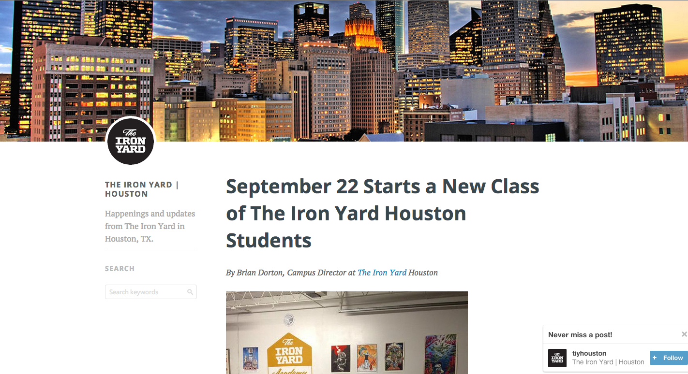

# Monday, Sept 22nd

Happy first day! Today we:

- listened to John talk about blogging and branding,
- covered some basic stuff on keyboard shortcuts,
- installed some programs,
- covered creating the HTML boilerplate code in Sublime Text,
- covered the ipsums (http://meettheipsums.com/),
- talked about `display:block` and `display:inline-block`,
- built a very simple blog layout,
- talked a bit about the Box Model,
- and mentioned some various resources (which will be listed below)

## The Code

Here's the code for the simple blog layout we made today (Hi, Carlton!):

- [link to code](./examples/day01)

We tried to recreate this layout:

## Resources

- http://meettheipsums.com/
- An article sent from John Saddington (today's speaker): http://www.sitepoint.com/6-real-world-networking-tips-developers/
- List of HTML tags: http://www.w3schools.com/tags/
- All the CSS properties! http://www.w3schools.com/cssref/

## Homework

- Start a blog! Use either http://tumblr.com or http://medium.com.
- Read about layout with CSS (mainly about `display` and `position`): http://learnlayout.com/
- Watch "The Long Game pt 1 and 2": http://delve.tv/essays/
- Copy the code from today, and experiment with as many HTML tags as possible
	- tags: http://www.w3schools.com/tags/
	- code from today: [link to code](./examples/day01)
	- When you finish, just zip your files and email them to me. We will be putting them on the "internets" tomorrow with Git!
