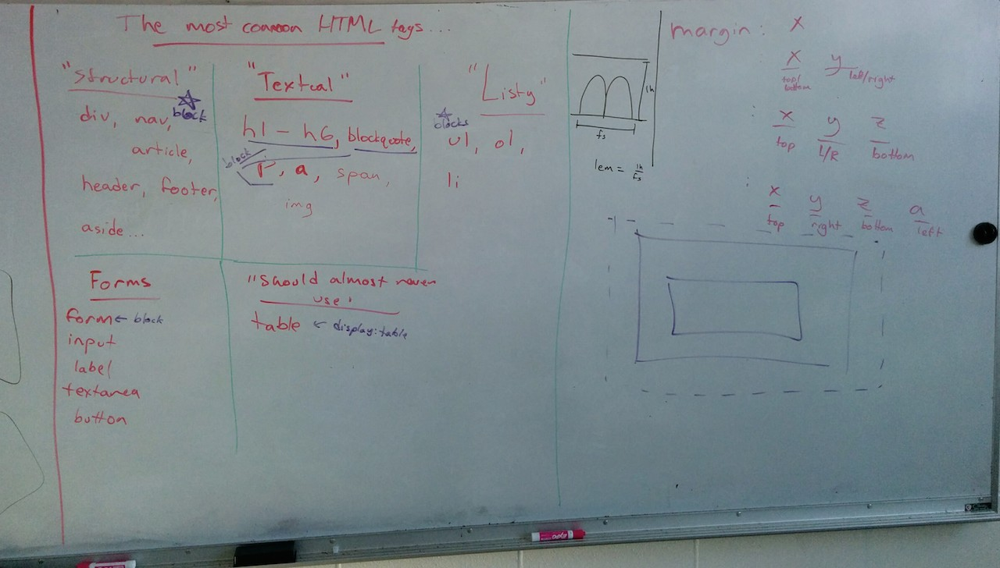

# Wednesday, Sept 24th

# Git review
```sh
# I created a new repo on Github... now what?

$ cd ~/Github\ Projects/
$ git clone <ssh url> <optional folder name>
$ cd <folder that we just cloned>

# I made an edit or added stuff.. now what?

$ git add <files>
# OR
$ git add --all .

$ git commit
# OR
$ git commit -m "ORLY?"

# Once I'm ready to publish... then what?

$ git push origin master

# ----
# I want to make a publicly visible gh-pages "folder" (a.k.a. branch)
# AND I haven't already created it yet

$ git branch
$ git checkout -b gh-pages
$ git push origin gh-pages
# ALWAYS MAKE YOUR EDITS IN "master"
$ git checkout master

# ---
# I want to add updates to gh-pages "folder" (a.k.a. branch)
# AND I HAVE already created it

$ git branch
$ git checkout gh-pages
$ git merge master
$ git push origin gh-pages
# ALWAYS MAKE YOUR EDITS IN "master"
$ git checkout master
```

# Layout and CSS Techniques

## Resources

- http://necolas.github.io/normalize.css/
- http://typeplate.com/
- http://kennethormandy.com/journal/normalize-opentype-css
- http://hellohappy.org/beautiful-web-type/
- http://learnlayout.com/

## Recommended Watching

- http://www.atozcss.com/media-queries/
- and like all those other videos (do 1 or 2 a night, it's amaze :doge:)

## Notes:

- we talked about common HTML tags vs display type,
- shorthand properties,
- ems,
- and we threw in an entire discussion on positioning and layout approaches from http://learnlayout.com/,
- Box Model and `boz-sizing: border-box`,


## Pics of Whiteboards



## Homework

Create an HTML version of this:


Remember!

- wireframe it, think about structure and how today's lecture can help you do 70-80% of the work.
- keep it simple, worry about structure and layout first, THEN worry about small details

Make sure to:

1. Create a Github repo
2. Clone that repo
3. Code the site
4. Even if it isn't perfect, send me your Github repo link and the `gh-pages` link

