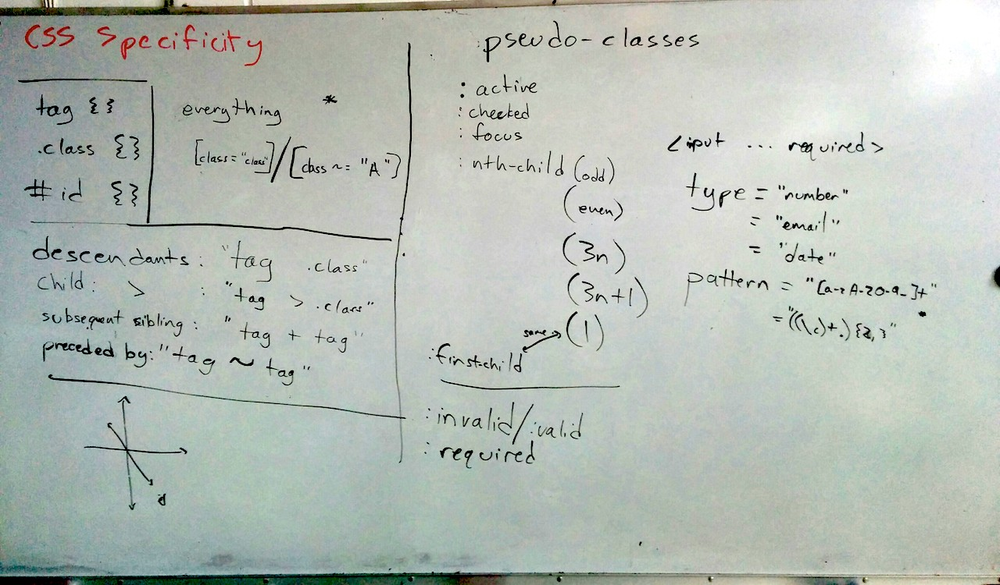
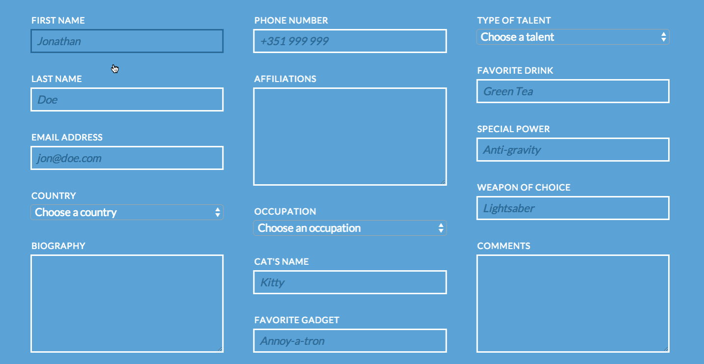

# Thursday, Sept 25th


```sh
 _________________________________________
/ Today we covered bower, CSS selectors   \
| and specificity, CSS pseudo-classes and |
| pseudo-objects, CSS transitions, CSS    |
\ transforms, and CSS keyframes           /
 -----------------------------------------
     \
      \
          oO)-.                       .-(Oo
         /__  _\                     /_  __\
         \  \(  |     ()~()         |  )/  /
          \__|\ |    (-___-)        | /|__/
          '  '--'    ==`-'==        '--'  '
```

# Example stuff from class

- https://github.com/TIY-Houston-Front-End-Sept-2014/DemoTimeline
- (gh-pages version) http://tiy-houston-front-end-sept-2014.github.io/DemoTimeline/

# Bower

```sh
# search for a CSS or JS library to include
$> bower search <package name>
# such as ...
$> bower search normalize


# install a file in your project directory
$> bower install <package name>
# such as ...
$> bower install normalize.css
```

# Go-to resources for front end projects

```sh
$> bower install normalize.css
$> bower install typeplate-starter-kit
```

Then include this in your `index.html`:

```html
<link rel="stylesheet" type="text/css" href="./bower_components/normalize.css/normalize.css">
<link rel="stylesheet" type="text/css" href="./bower_components/typeplate-starter-kit/css/typeplate.css">
```

# CSS Selectors

Find a list of pseudo-classes, combinators, and selectors here:

- http://css-tricks.com/almanac/
- http://www.w3schools.com/cssref/css_selectors.asp



# Resources

- http://css-tricks.com/almanac/
- http://css-tricks.com/almanac/properties/a/animation/
- CSS pseudo-classes and selectors
- http://a.singlediv.com/
- http://spacecityjs.com/
- http://www.atozcss.com/
- `currentColor`
- `::before` / `::after`
- The `say` command - http://www.gabrielserafini.com/blog/2008/08/19/mac-os-x-voices-for-using-with-the-say-command/
- http://codepen.io/patterns/

# Homework

## Part 1

> Use the CSS selectors covered today with form elements to create some cool effects. Particularly make use of:

- `<input type="..." required>` - the `required` attribute
- `<input type="..." pattern="...">` - the `pattern` attribute
- and the `:invalid`, `:required`, `:optional`, `:focus`, `:hover`, `:active` CSS pseudo-classes
- the `::before` and `::after` CSS pseudo-objects



## Part 2

> Get through as much as you can. I know it is hard!! I'm not looking for perfect. We'll discuss some last details on CSS on Monday before starting JavaScript soon. So come hungry for knowledge!

This is a responsive, grid-like layout with lots of practice with `float`, and positioning.

