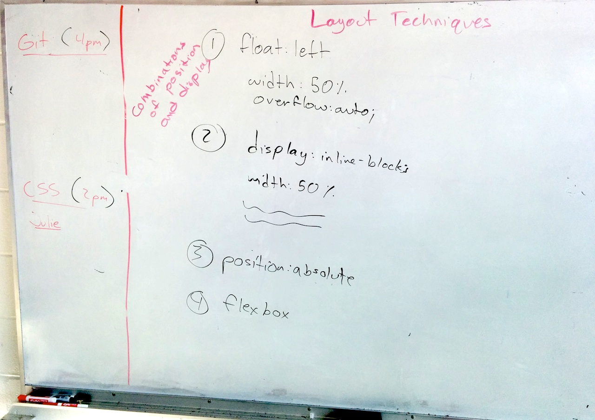
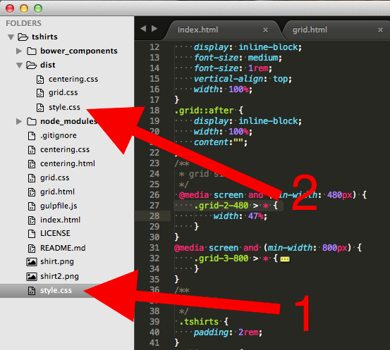
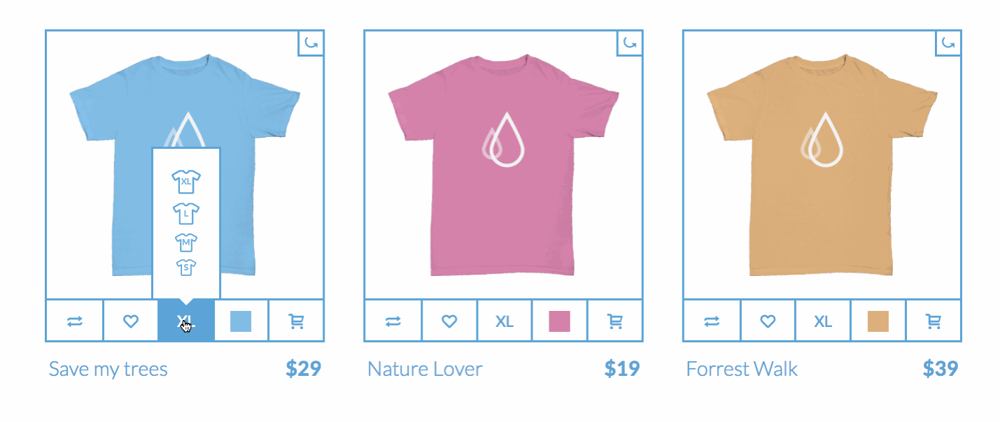

# Monday, Sept 29th


```sh
  _________________________________________
/ today we covered layout techniques, the \
| justify-text-inline-block grid,         |
| iconfonts and other icon resources,     |
| gulp, box-sizing, aspect-ratio fixing   |
\ with ::after, nth-of-type()             /
 -----------------------------------------
      \                    / \  //\
       \    |\___/|      /   \//  \\
            /0  0  \__  /    //  | \ \
           /     /  \/_/    //   |  \  \
           @_^_@'/   \/_   //    |   \   \
           //_^_/     \/_ //     |    \    \
        ( //) |        \///      |     \     \
      ( / /) _|_ /   )  //       |      \     _\
    ( // /) '/,_ _ _/  ( ; -.    |    _ _\.-~        .-~~~^-.
  (( / / )) ,-{        _      `-.|.-~-.           .~         `.
 (( // / ))  '/\      /                 ~-. _ .-~      .-~^-.  \
 (( /// ))      `.   {            }                   /      \  \
  (( / ))     .----~-.\        \-'                 .~         \  `. \^-.
             ///.----..>        \             _ -~             `.  ^-`  ^-_
               ///-._ _ _ _ _ _ _}^ - - - - ~                     ~-- ,.-~
                                                                  /.-~
```

# Layout Techniques



# Matt's "Justify-Text-Inline-Block" Grid

http://tiy-houston-front-end-sept-2014.github.io/TShirts/grid.html

Example HTML:

```html
<div class="grid grid-2-480 grid-3-800 purple-grid">
    <span></span>
    <span></span>
    <span></span>
    <span></span>
</div>
```

```css
/* keeps the padding growing inwards /*
*, *::before, *::after {
	box-sizing: border-box;
}

.grid {
	font-size: 0px; /* keeps spaces between the grid elements to size 0 */
	text-align: justify; /* spreads the grid items out on the horizontal line */
	position: relative;
}

/* needed to make the grid elements justify themselves */
.grid::after {
	content: "";
	display: inline-block;
	width: 100%;
}

.grid > * {
	display: inline-block;
	width: 100%;
	text-align: left;
	font-size: medium; /* reset the font size since it was set to 0px inside the grid */
	vertical-align: top;
	transition: all .25s ease;
}

/*
	add a media query to handle screensizes, note the semantic name I chose to give this CSS class:

	.grid- "a grid class"
	-2- "2 columns"
	-480 "when the screen is atleast 480px wide"
*/
@media (min-width: 480px){
	.grid-2-480 > * { width: 47%; }
}

@media (min-width: 800px){
	.grid-3-800 > * { width: 31%; }
}

/* less re-usable styles are put into another CSS class so that I can reuse .grid on other parts of a site */
.purple-grid > * {
	background-color: purple;
	padding: 2em;
	color: white;
	margin-bottom: 2em;
}
```

# Font and Icon Resources

- fontawesome - http://fortawesome.github.io/Font-Awesome/get-started/
- nounproject - http://thenounproject.com/
- icomoon - https://icomoon.io/
- iconmelon - http://iconmelon.com/

# Forcing Aspect-Ratio

Forcing the aspect ratio can be done with an `::after` pseudo-element. In this case, `padding-top: 100%;` means give the `::after` element a top padding that is 100% of the container's width.

```css
.squarify > *::after {
	content: "";
	display: block;
	padding-top: 100%;
}
```

# `:nth-of-type()` and other stuff

http://css-tricks.com/almanac/

# Absolute Centering

http://tiy-houston-front-end-sept-2014.github.io/TShirts/centering.html

```css
*, *::before, *::after {
    box-sizing: border-box;
}
.square {
    margin: auto;
    width: 200px;
    background-color: chartreuse;
}
.square::after {
    content:"";
    display: block;
    padding-top: 100%;
}
.centerify {
    position: absolute;
    top: 50%;
    left: 50%;
    transform: translate(-50%, -50%);
}
```

# Tshirts Example

- http://tiy-houston-front-end-sept-2014.github.io/TShirts/
- https://github.com/TIY-Houston-Front-End-Sept-2014/TShirts

# Sublime Package Control

1. Open Sublime Terminal with `CTRL + ~`.
2. Copy and paste the Sublime Text 3 code from https://sublime.wbond.net/installation to the Sublime Terminal.
3. Hit Enter.
4. Close Sublime Terminal with `ESC`.
5. Open Package Control `CMD + SHIFT + P`.
6. Type `install`, notice all the options you can do and how Sublime suggests items based on what you are searching for.
7. Select the item named `Package Control: Install Package`.
8. Search for `DocBlockr` and `Sublime-HTMLPrettify` and install!

# DocBlockr

In your CSS, on a new line, type `/**` then `ENTER`.

# Prettify

In any code, type `CMD + SHIFT + H`. Boom! Formatting.

# Gulp

Gulp is a nice build tool that can do stuff like autoprefix our CSS for us. Which is exactly what we'll do here. For more info on Gulp, see http://gulpjs.com/.

1. First, install Gulp with `sudo npm install gulp gulp-autoprefixer --savedev`.
- Now, create a file called `gulpfile.js` in your project directory and put these contents in it:
	```js
		var gulp = require('gulp');
		var autoprefixer = require('gulp-autoprefixer');

		gulp.task('prefix', function () {
		    return gulp.src('./*.css')
		        .pipe(autoprefixer({}))
		        .pipe(gulp.dest('dist'));
		});

		gulp.task('watch', function () {
			gulp.watch("./*.css", ['prefix']);
		});
	```
- In your terminal, run
	```sh
	echo "node_modules" >> .gitignore
	```
- In your terminal, run `gulp watch`.
- Point your `<link href="...">` in your HTML to the `./dist/style.css` file instead of `./style.css` to use the auto-prefixed version.

Now, whenever you edit a CSS file in your project directory, Gulp will put a prefixed version of that CSS in a folder called `dist`.



# Homework

- Finish your Tshirts!



- Got extra time? **Watch http://www.atozcss.com/ and take notes on them and write blog posts.** Optionally after that, start a small group project creating a website.
