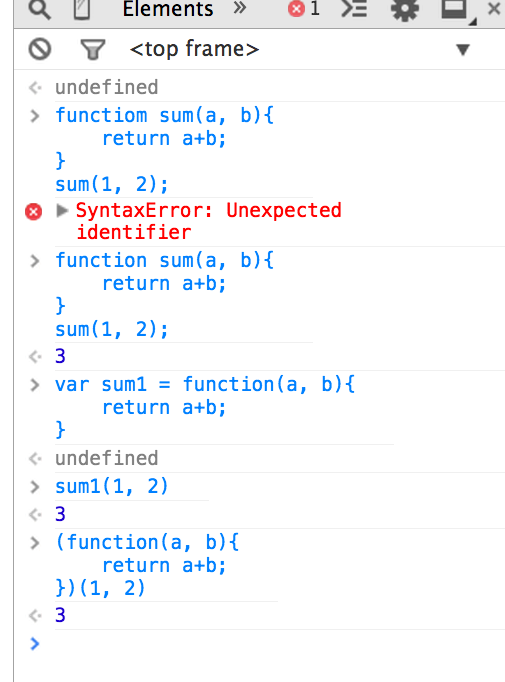

# Tuesday, Sept 30th

```sh
 _______________________________________
/ Today, we covered an intro to         \
| JavaScript, the language syntax,      |
| constructs, variables, primitives and |
| object data types (numbers, booleans, |
| strings, arrays, objects), operators, |
| accessor chaining, assignments,       |
| functions and the many ways to write  |
\ them, IIFEs, and strict mode          /
 ---------------------------------------
   \         ,        ,
    \       /(        )`
     \      \ \___   / |
            /- _  `-/  '
           (/\/ \ \   /\
           / /   | `    \
           O O   ) /    |
           `-^--'`<     '
          (_.)  _  )   /
           `.___/`    /
             `-----' /
<----.     __ / __   \
<----|====O)))==) \) /====
<----'    `--' `.__,' \
             |        |
              \       /
        ______( (_  / \______
      ,'  ,-----'   |        \
      `--{__________)        \/
```

# Browser Rendering Process
1. loads HTML
2. finds tags from top to bottom, and tries to render them
3. CSS found! - loads it in parallel and continues
4. JS found! - loads and executes it while blocking everything else :-(

# JavaScript (JS) can...
1. read from and write to the DOM (Document Object Model - the live HTML on the page)
2. handle events ("click", etc) on the page
3. compute anything without touching the UI

# How to Solve a Problem
1. Start with your goal. (Make a peanut butter & jelly sandwich)
2. Write out the steps.
3. Draw pictures.
4. Write code.

# Types

1. **Primitives** - simple values that can be passed around and referenced directly. They are kind of like cash. If you give someone a $5 bill, they have the money and they can use it immediately.

	- Numbers - `0`, `-1`, `49.123`, `0x000010`, `2e5`
	- Booleans - `true`, `false`
	- Strings -

		```js
		'Cool';
		"Cool";
		"That was 'cool'";
		"That was \"cool\"";
		"how much wood could a woodchuck chuck if woodchuck could chuck wood?";
		```

- **Objects** - more abstract "things". They are like checks. They're too complex to be passed around or referenced directly, you have to know how to use them to actually get the value out of them.

	- Literals

		```js
		{
			name: "Matt",
			height: "6'2\"",
			Name: "Instructor"  //<-- case sensitive property names
		}
		```
	- Arrays

		```js
		var names = ["Matt", "Mark", "Mike", "Mitch", "Moe"];
		```
	- Functions

		```js
		function sum(a, b){
			return a+b;
		}
		```
	- there will be many more...

# Variables

```js
	var x = 5;
```

Variables are like labeled boxes, where the box `x` has the number `5` inside it.

Variables can be named almost anything with alphanumeric characters (numbers, lower and uppercase letters), underscores, and dollar signs ($). The only condition is that the name cannot start with a number.

Variable names are case sensitive.

The convention, but not rule, is to capitalize each word after the first:

```js
	var someCoolVariable;
```

**Declare multiple variables:**

```js
var age, favoriteColor, name;
```

**Declare and assign multiple:**

```js
var age = 37,
	favoriteColor = "green",
	name = "Jake";
```

The following are all reserved words, meaning you cannot create a variable with any of these names:

`arguments`, `break`, `case`, `catch`, `class`, `const`, `continue`, `debugger`, `default`, `delete`, `do`, `else`, `enum`, `export`, `extends`, `false`, `finally`, `for`, `function`, `if`, `implements`, `import`, `in`, `instanceof`, `interface`, `let`, `new`, `null`, `package`, `private`, `protected`, `public`, `return`, `static`, `super`, `switch`, `this`, `throw`, `true`, `try`, `typeof`, `var`, `void`, `while`

> Kevin Henney points out that the “labeled boxes” analogy also works nicely for introducing “arrays (a row or column of boxes) and objects (a group of boxes).” Ikai Lan likes how “box size is a good analogy for type discussions later on.”
>
> https://twitter.com/KevlinHenney/status/372598874462253056
> https://twitter.com/ikai/status/372656503947149312

# Code Comments

In JavaScript, there are two types of comments (a.k.a. ways to put a note in the code)

```js
	// single line comment

	/*
		and a multi-line
		comment
		.
	 */
```

# Operators

- assignment operator: `=`
- mathematical operators: `+`, `-`, `*`, `/`, `++`, `--`, `%`
- compound operators: `+=`, `-=`, `*=`, `/=`
- conditional operators: `!`, `==`, `===`, `!=`, `!==`, `>`, `>=`, `<`, `<=`
- grouping operators: `( ... )` e.g. `(5+9)*3`
- function operators: `()` e.g. `sum(5, 10)`
- string operator: `+`

For more, see https://developer.mozilla.org/en-US/docs/Web/JavaScript/Guide/Expressions_and_Operators

# Accessors

In JavaScript, we can access properties of an object with `.`:

```js
var instructor = {
	name: "Matt",
	height: "6'2\"",
	laptop: {
		type: "MacBook Air"
	}
};

instructor.name; //<-- "Matt"
instructor.laptop.type; //<-- "MacBook Air"
```

# Statements

Statements can consist of a combination of accessors and operators:

```js
instructor.name + " owns a " + 2013 + instructor.laptop.type; //<-- "Matt owns a 2013 MacBook Air"
```

Like a sentence, a statement is one coherent "thought" or instruction.
- It should appear on its own line.
- It should end with a semicolon (a semicolon means "this instruction is over, move to the next one.")

# Assignments

Assignments have a new or existing variable, an assignment operator `=`, and then a statement.

```js
var x = (2 + 45) + "a"; //<-- x is "47a"
x += (45 + 2); //<-- x is "47a47"
```

JavaScript ignores spaces, tabs, and newlines that appear in JavaScript programs. So write your code and end each statement with a semicolon `;`. Then use `Prettify` in Sublime Text to keep things clean.

# Functions

Functions are the reusable, composable building-blocks of JavaScript. Functions are declared and used, sometimes in the same statement, sometimes in a seperate statement:

```
functiom sum(a, b){
	return a+b;
}
sum(1, 2); //<-- 3

// or

(functiom (a, b){
	return a+b;
})
(1, 2); //<-- 3
```

`return` is a statement inside functions that "unboxes" a value where the function was invoked:

```
var a = sum(1,2) + 4;
// becomes
//  a = 3 + 4
// then
//  a = 7
a; //<-- 7
```

# IIFEs (Immediately Invoked Function Expressions)



# Strict Mode

ECMAScript 5 has a strict mode that results in cleaner JavaScript, with fewer unsafe features, more warnings, and more logical behavior. The normal (nonstrict) mode is sometimes called "sloppy mode."

You can switch on strict mode by writing it inside functions like this:

```js
function foo() {
    'use strict';
    // ...
}
```

I am going to recommend that you `use strict` mode (see what I did there? :thumbsup:) for the code you write.

# Using JavaScript

## In <head>

```html
<head>
  <title>Cool</title>
  <script type="text/javascript">
    var cool = true;
  </script>
</head>
```

## External file (preferred)

At the end of the body:

```html
<body>
  <h1>Hay</h1>
  <script type="text/javascript" src="main.js"></script>
</body>
```

# Homework

[Homework 7 - JavaScript Beginnings](./examples/day07/hw07.js)

# next up

- more on arrays, array functions, scope, `this`
- more on objects, object functions, object accessors (`.` vs `[]`)
- conditional statements (if, if-else, switch, ternary)
- loops (for, while, do-while, array.forEach), loop labels (http://en.wikipedia.org/wiki/JavaScript_syntax#Labels)
- functional programming with lodash
- DOM APIs
- JSON APIs, jQuery ajax
- events
- more functions, function functions
- Date() objects
- Regex
- Error handling, try-catch-finally, throw
- Prototypes and Constructors
	```js
		base = new Base();
		Derived.prototype = base; // Must be before new Derived()
		Derived.prototype.constructor = Derived; // Required to make `instanceof` work
	```
- closures and private variables

# Resources

- http://bonsaiden.github.io/JavaScript-Garden/