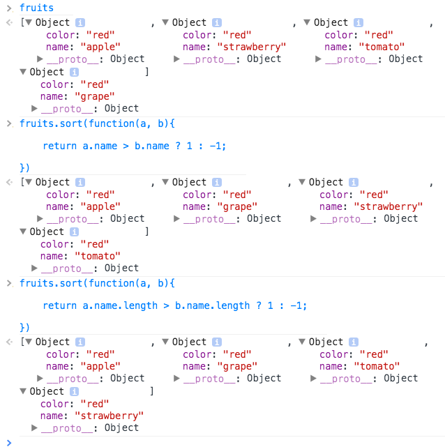

# Wed, October 1

```sh
 _______________________________________
/ Today we covered more on accessors (. \
| vs []), conditional blocks, loops,    |
| arrays and array methods, Date(),     |
\ type coercion, and DOM APIs           /
 ---------------------------------------
\                             .       .
 \                           / `.   .' "
  \                  .---.  <    > <    >  .---.
   \                 |    \  \ - ~ ~ - /  /    |
         _____          ..-~             ~-..-~
        |     |   \~~~\.'                    `./~~~/
       ---------   \__/                        \__/
      .'  O    \     /               /       \  "
     (_____,    `._.'               |         }  \/~~~/
      `----.          /       }     |        /    \__/
            `-.      |       /      |       /      `. ,~~|
                ~-.__|      /_ - ~ ^|      /- _      `..-'
                     |     /        |     /     ~-.     `-. _  _  _
                     |_____|        |_____|         ~ - . _ _ _ _ _>
```

# New Homework Submission Process

I will check your GH accounts once a day and look for your latest there. This will save me time versus chasing down emails and Hipchat messages.

**BUT** that means keep your code updated on Github. You should be committing and pushing to Github atleast 5 times a day.

# DOM APIs

- `document.getElementById`
- `document.getElementByTagName`
- `document.getElementsByClassName`
- `document.querySelector`
- `document.querySelectorAll`

**what we can edit/read on DOM elements**

- `attributes` (`classList`, `className`, `id`, etc)
- `textContent`
- `innerHTML`
- `style`
- and many more...

# Accessors (`.` vs `[]`)

```js
sum += person.finishingTime1;
sum += person["finishingTime1"];
sum += person["finishingTime"+1];
```

# Conditional statements and blocks

- `if`

    ```js
    if(){
        ...
    }
    ```

- `if`/`else`

    ```js
    if(){

    } else {

    }
    ```

- `if`/`else if`/`else`

    ```js
    if(){

    } else if(){

    } else if(){

    } else {

    }
    ```

- `switch`

    ```js
    var answer = "A";

    switch (answer.toLowerCase()) {
        case "A":
            console.log("Correct");
            break;
        default:
            console.log("Incorrect");
            break;
    }
    ```

- `ternary`

    ```js
    var result = true ? "yey for red" : "it's actually salmon"; //<-- "yey for red"
    ```

- `short-circuited statement`

    ```js
    var isMyShirtRed = false;
    var result = (!isMyShirtRed && "it's actually salmon") || "yey for red";
    ```

# Loops

- `for`

    ```js
    for(declare vars; conditional; modifier){
        .. do shit X amount of times
    }
    ```

- `for-in`

    ```js
    "use strict";

    var matt = {
        finishingTime1: 240, //in minutes
        finishingTime2: 210.4,
        finishingTime3: 235.1,
        finishingTime4: 208.9,
        finishingTime5: 197.5,
        unqualifyingFinishingTime: 250.5,
        unqualifyingFinishingTime2: 350.5
    };

    var getAverageTime = function(person) {
        "use strict";
        var sum = 0;
        for(var index in person){
            sum += person[index];
        }
        return sum / Object.keys(person).length;
    }

    console.log(getAverageTime(matt));
    ```

- `while`

    ```js
    var matt = {
        finishingTime1: 240, //in minutes
        finishingTime2: 210.4,
        finishingTime3: 235.1,
        finishingTime4: 208.9,
        finishingTime5: 197.5,
    };

    var getAverageTime = function(person) {
        "use strict";

        var sum = 0,
            i = 1,
            length = Object.keys(person).length;

        while(i <= length){
            sum += person["finishingTime"+i];
            i++;
        }

        return sum / length;
    }

    console.log(getAverageTime(matt));
    ```

- `do`/`while`

    ```js
    var matt = {
        finishingTime1: 240, //in minutes
        finishingTime2: 210.4,
        finishingTime3: 235.1,
        finishingTime4: 208.9,
        finishingTime5: 197.5,
    };

    var getAverageTime = function(person) {
        "use strict";

        var sum = 0,
            i = 1,
            length = Object.keys(person).length;

        do {
            sum += person["finishingTime"+i];
            i++;
        } while(i <= length)

        return sum / length;
    }

    console.log(getAverageTime(matt));
    ```

# Arrays

- creating arrays

    ```js
    var names = ['matt', 'mark', 'mike'];

    // or

    var names = new Array(3);
    name[0] = 'matt';
    name[1] = 'mark';
    name[2] = 'mike';
    ```

- array methods and properties

    - `length`
    - `indexOf` / `lastIndexOf`
    - `push` / `pop`
    - `unshift` / `shift`
    - `join`
    - `forEach`
    - `sort`
    - `reverse`
    - `slice`
    - `filter`
    - `map`
    - `reduce`
    - `concat`

    ```js
    var fruits = [{
        name: "apple",
        color: "red"
    }, {
        name: "strawberry",
        color: "red"
    }, {
        name: "tomato",
        color: "red"
    }, {
        name: "grape",
        color: "red"
    }]

    fruits = fruits.filter(function(fruit){
        return fruit.color === "red";
    }).map(function(fruit){
        return fruit.name;
    })

    console.log(fruits.join(", "));
    ```

    
    
    
    
    
    
    
    

# Date()


# Implicit Type coercion

http://bonsaiden.github.io/JavaScript-Garden/#types

# `instanceof` / `typeof`


# Want to auto-commit your work to gh-pages?

Create a file in your repo directory with:

```sh
touch .git/hooks/post-commit
sublime .git/hooks/post-commit
```

... open it with sublime and add this as the content and save it:

```sh
#!/bin/sh
git checkout gh-pages
git merge master
git checkout master
```

Then every time you commit and push, `gh-pages` should be automatically updated, too!

You just need to do this:

```sh
git push --all
```

More here: http://oli.jp/2011/github-pages-workflow/

# Homework

- read http://bonsaiden.github.io/JavaScript-Garden/#types
    - then create a Github project called `Typerator` and give atleast 20 examples of the reading
- part 2 is coming soon...