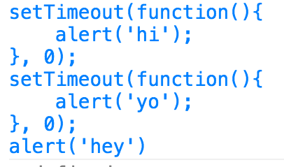
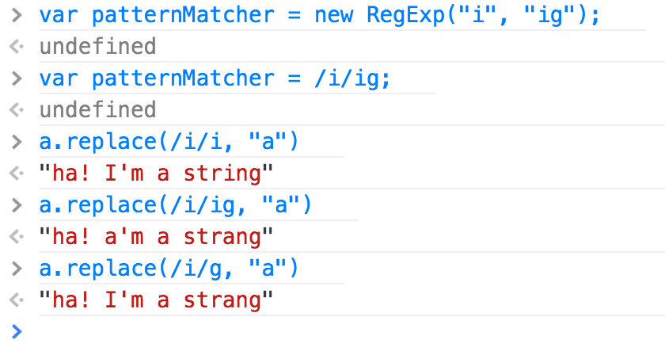
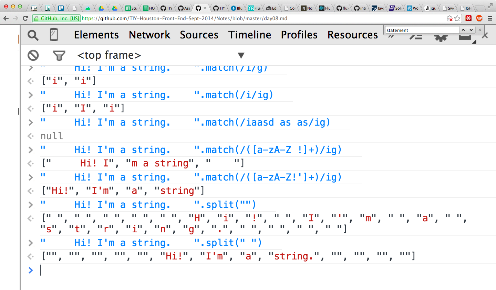
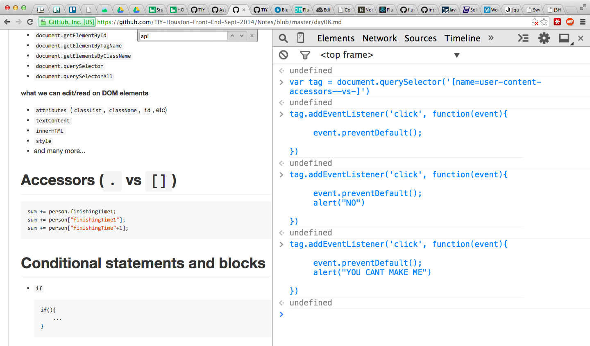
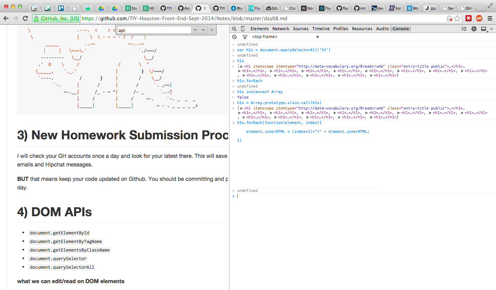

# Thu, October 2nd

```js
 _________________________________________
/ Today we reviewed the rovarspraket      \
| homework problem, talked about the      |
| 'unexpected ..' errors in JavaScript,   |
| JSHint, Automatic Semicolon Insertion,  |
| String methods, loop labels, the        |
| continue keyword, Reguler Expressions   |
| (RegExp),                               |
| setInterval/setTimeout/clearInterval/cl |
| earTimeout, and more on using DOM APIs  |
| to set the innerHTML of an array of     |
\ HTMLElement objects                     /
 -----------------------------------------
   \
    \
      _____   _________
     /     \_/         |
    |                 ||
    |                 ||
   |    ###\  /###   | |
   |     0  \/  0    | |
  /|                 | |
 / |        <        |\ \
| /|                 | | |
| |     \_______/   |  | |
| |                 | / /
/||                 /|||
   ----------------|
        | |    | |
        ***    ***
       /___\  /___\

```

# Automatic Semicolon Insertion

Read up on this here: http://bonsaiden.github.io/JavaScript-Garden/#core.semicolon

We talked in class about how JavaScript will imply where semicolons should go if you omit them, and where we can omit curly braces (`{}`) with conditional and loop blocks:

```js
// valid one-line loops
for(...) some one line statement;
while(...) some one line statement;

// valid one-line conditionals
if() some one line statement;

// valid for-loop block
for(...){
	some one line statement;
}

// valid if block
if(){
	some one line statement;
}

// valid return statements
return {};
return {}

// not a good return statement

return //<-- ; assumed here, so undefined will be returned, not {a: 0}
	{
		a: 0
	}

// valid function declaration
function(){
	//...
}

// function declaration in an assignment statement, semicolon recommended
var x = function(){};
```

# `setInterval()`, `setTimeout()`

Test the following in Chrome dev tools:

```js
var d = new Date(),
	interval = 3000; //1000ms = 1s

var id = setInterval(function() {
    d.setTime(d.getTime() + interval);
    console.log(d.getHours() + ":" + d.getMinutes() + ":" + d.getSeconds());
}, interval);
```

If you want to make the interval stop executing every 3000ms, run:

```js
clearInterval(id);
```



# String methods (and some RegExp)

```js
"a".anchor("test")
"a".bold()
"hello there!".link("test"); //<-- "<a href="test">hello there!</a>"


"    Hi! I'm a string. ".trim(); //<-- "Hi! I'm a string."

"hello".charAt(0); //<-- "h"
"hello"[0]; //<-- "h"

"a".charCodeAt(0); //<-- 97
"b".charCodeAt(0); //<-- 98
"Z".charCodeAt(0); //<-- 90

"Z" < "a"; //<-- true (because "Z"'s charcode is less than "a"' charcode)

String.fromCharCode(97); //<-- "a"

"howdy".indexOf("o"); //<-- 1
"howdy".indexOf("ow"); //<-- 1
"howdy".indexOf("nope"); //<-- -1

"hello there!".length; //<-- 12

"howdy".replace("owd", "ey bab"); //<-- "hey baby"

"hi mi fli whi GI Ri Shi".replace(/i/, "a"); //<-- "ha mi fli whi GI Ri Shi"
"hi mi fli whi GI Ri Shi".replace(/i/ig, "a"); //<-- "ha ma fla wha Ga Ra Sha"
"hi mi fli whi GI Ri Shi".replace(/hi/ig, "a"); //<-- "a mi fli wa GI Ri Sa"

"a-b-c".split(""); //<-- ["a", "-", "b", "-", "c"]
"a-b-c".split("-"); //<-- ["a", "b", "c"]

"hello there!".substr(0, 5); //<-- "hello"
"hello there!".substr(1, 5); //<-- "ello "
"hello there!".substr(2, 5); //<-- "llo t"
"hello there!".substr(3, 5); //<-- "lo th"
"hello there!".substr(4, 5); //<-- "o the"
"hello there!".substr(5, 5); //<-- " ther"
"hello there!".substr(6, 5); //<-- "there"

"i'M AlL FuNKy LoOkINg".toLowerCase(); //<-- "i'm all funky looking"
"i'M AlL FuNKy LoOkINg".toUpperCase(); //<-- "I'M ALL FUNKY LOOKING"

```

# `RegExp`




# Loop labels

```js
outerLoop: for(var i=0; i<10; i++){
    innerLoop: for(var j=0; j<10; j++){
    	if(i*j > 70){
    		break outerLoop;
    	}
    	console.log(i, j);
    }
}
```

# `continue`

```js
for(var i=0; i<10; i++){
	if(i % 2 === 0){
		continue;
	}
	console.log(i);
}
```

# Combining DOM APIs, loops, and strings to dynamically change content on a Github page





# Homework

Keep working on your [day 8 homework assignment](./examples/day08/hw08.js)
