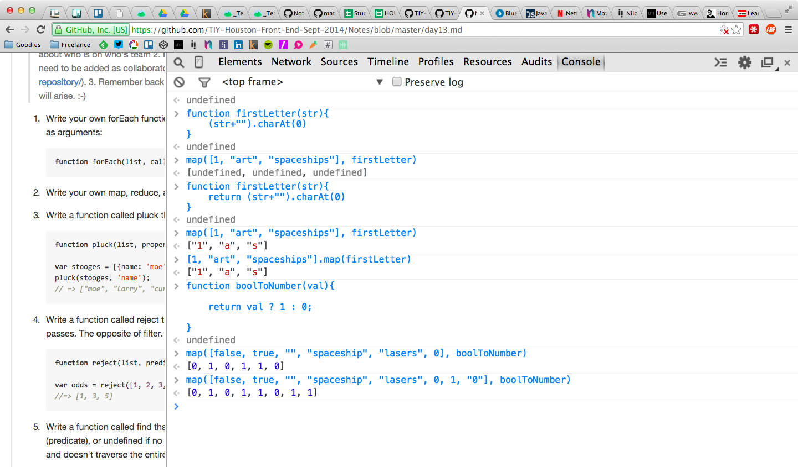
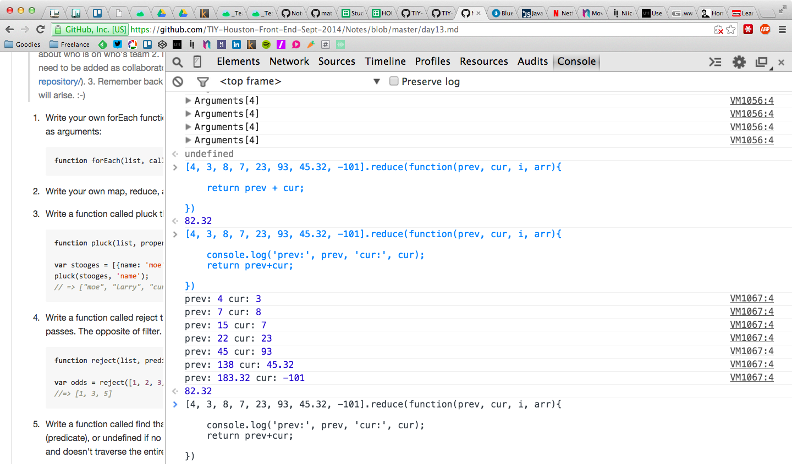
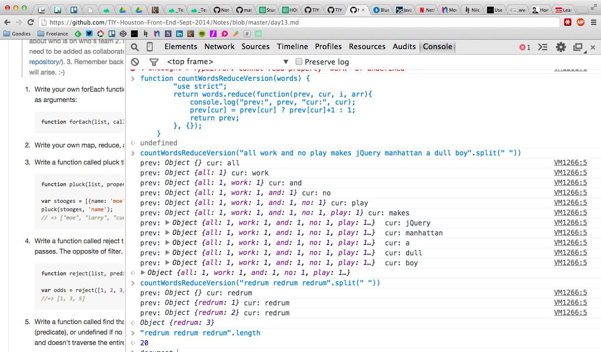
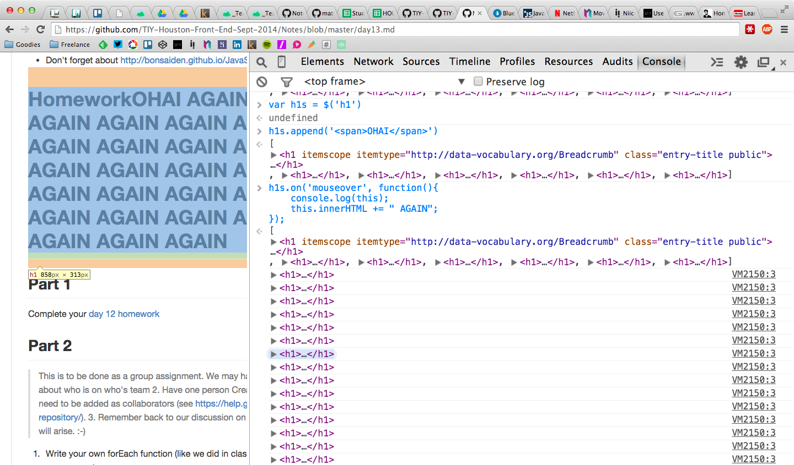
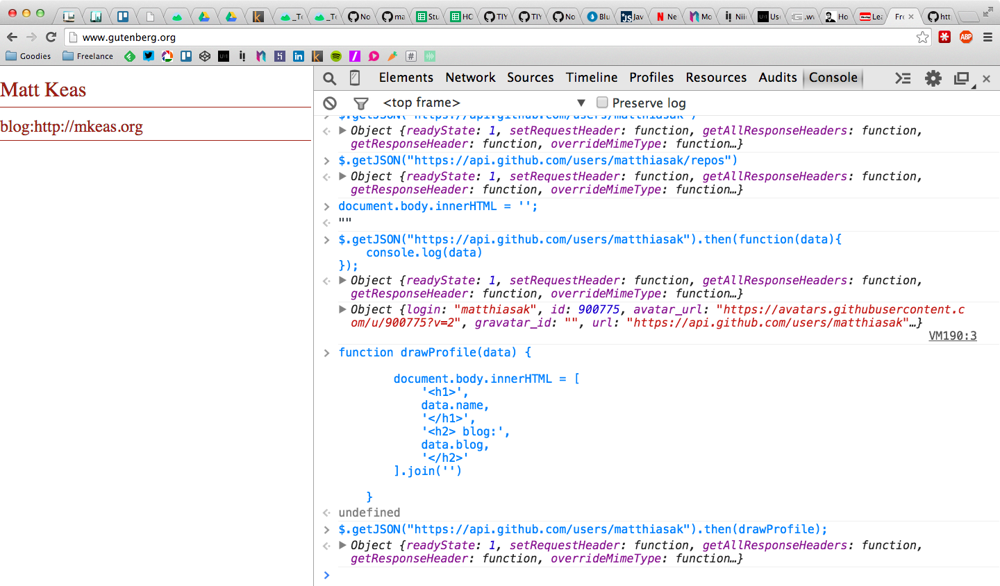

# Monday, Oct 13th

```sh
 _________________________________________
/ today we covered review of the weekend  \
| lab, covered how everything is built on |
| forEach(), and covered some jQuery -    |
| how it just wraps                       |
| document.querySelector/All, how we can  |
| handle events with $.on(), and how to   |
| pull data from the interwebs with       |
\ $.get()/$.getJSON()                     /
 -----------------------------------------
   \
    \
        .--.
       |o_o |
       |:_/ |
      //   \ \
     (|     | )
    /'\_   _/`\
    \___)=(___/
```

# jQuery's AJAX functions

jQuery has some built-in methods of requesting and sending information to and from a server. We covered `$.get()` and `$.getJSON` today. We will get to posting information to a server shortly.

- `$.get(url).then(function(data){...})`

	http://api.jquery.com/jQuery.get/


- `$.getJSON(url).then(function(data){...})`

	http://api.jquery.com/jQuery.getJSON/


- `$.ajax(options).then(function(data){...})`
- `$.post(url).then(function(data){...})`

All of the above methods return a **jQuery Promise** object that has a `then` method. This is how we handle **asynchronous** communications in JavaScript. Promises are used because we don't know when the AJAX request will return (.5s? 1s? 10s? never?).

```js
var githubUsername = "matthiasak";
var url = "https://api.github.com/users/"+githubUsername;
var result = $.get(url);
result.then(function(data){
	// do something with the data retrieved
})
```

# In-class notes from today

Today we focused a lot on the homework assignment. Each function was built on-top of our own custom `forEach()`, which in turn is just built on-top of a for loop:

```js
/**
 * forEach item in the list, pass it to callback with its index
 */

function forEach(list, callback) {
    for (var i = 0, len = list.length; i < len; i++) {
        callback(list[i], i, list);
    }
}
```

# map

```js
/**
 * creates a new array, where each item in the return is the result of the callback function for that iteration
 * @param  {array}   subject
 * @param  {Function} callback
 * @return {array}
 */

function map(subject, callback) {
    var newsubject = [];
    forEach(subject, function(val, i, arr) {
        newsubject.push(callback(val, i, arr));
    })
    return newsubject;
}
```



# reduce

```js
function reduce(list, callback, initialValue) {
    var prevVal = initialValue;

    // if initialValue, prepend to list
    if(initialValue) list.unshift(initialValue);
    // for each item (starting from first position)
    forEach(list, function(val, i, arr) {
        if(i === 0) return;
        // overwrite the previous result with the latest one
        prevVal = callback(prevVal, arr[i], i, arr);
    });
    // return the final value
    return prevVal;
}
```





# filter

```js
function filter(list, callback) {
    var newList = [];
    forEach(list, function(val, i, arr) {
        if (callback(val, i, arr)) {
            newList.push(val);
        }
    })
    return newList;
}
```

# pluck

```js
function pluck(list, propertyName) {
    var newList = [];
    forEach(list, function(val, i, arr) {
        newList.push(val[propertyName]);
    })
    return newList;
}

var stooges = [{
    name: 'moe',
    age: 40
}, {
    name: 'larry',
    age: 50
}, {
    name: 'curly',
    age: 60
}];
console.dir(pluck(stooges, 'name'));
```

# reject

```js
function reject(list, callback) {
    var newList = [];
    forEach(list, function(val, i, arr) {
        if (!callback(val, i, arr)) {
            newList.push(val);
        }
    })
    return newList;
}

var odds = reject([1, 2, 3, 4, 5, 6], function(num) {
    return num % 2 == 0;
});
console.log(odds)
```

# jQuery and `$("h1").on("mouseover", function(){ ... })`



# more examples

```js
// ---------------------
// Remember this from day 8?
// Write a function findLongestWord() that takes an array of words and returns the length of the longest one.
// ---------------------

function findLongestWordNonReduceVersion(words) {
    "use strict";
    var longestWord = "";
    words.forEach(function(w) {
        if (longestWord.length > w.length) longestWord = w;
    });
    return longestWord;
}

function findLongestWordReduceVersion(words) {
    "use strict";
    return words.reduce(function(prev, cur, i, arr) {
        console.log("prev:", prev, "cur:", cur);
        return prev.length > cur.length ? prev : cur;
    });
}

// ---------------------
// Let's count the occurrences of words in an array of words
// ---------------------
function countWordsReduceVersion(words) {
    "use strict";
    return reduce(words, function(prev, cur, i, arr) {
        prev[cur] = prev[cur] ? prev[cur] + 1 : 1;
        return prev;
    }, {});
}

countWordsReduceVersion("hello there".split(" "))

// ---------------------
// Let's count the occurrences of words in an array of words from project gutenberg
// ---------------------
var url = "http://www.gutenberg.org/cache/epub/47083/pg47083.txt"
$.get(url).then(function(data){
    console.log(countWordsReduceVersion(data.split(/\s+/)))
})
```

# Live drawing data pulled from `$.get()` to the DOM

```js
// ---------------------
// Let's draw some info from our github profiles to the screen
// NOTE: you will need jQuery loaded on the page!
// ---------------------
var githubUsername = "matthiasak";
var url = "https://api.github.com/users/"+githubUsername;
$.get(url).then(function(data){
    drawProfile(data);
})
function drawProfile(data) {
    document.body.innerHTML = [
        '<h1>',
        data.name,
        '</h1>',
        '<h2> blog:',
        data.blog,
        '</h2>'
    ].join('')
}
```



# Homework

## Part 1
Finish your homework [from the weekend lab](./day13.md)

## Part 2

Build a github profile app that prints out some info from your github user account and repository info (e.g. https://github.com/matthiasak?tab=repositories).

- install all the goodies to your new Github repo with bower (normalize, typeplate, jquery)
- save our gulpfile, and run `npm install gulp gulp-autoprefixer gulp-jshint --save-dev`
- create our git-post-hook
- https://api.github.com/ lists endpoints for grabbing information off of Github. I crawled through the URL's and found that I could grab my:
	- user info from https://api.github.com/users/matthiasak
	- and repos info from https://api.github.com/users/matthiasak/repos
	- **NOTE** replace my username with your own
- re-use, and embellish my `drawProfile` function given above in the notes, and draw your own information to the screen. Style it up a bit with CSS.
	I want you to atleast use these properties from your github profile:
	- name
	- blog
	- location
	- email
	- avatar_url
	- html_url
