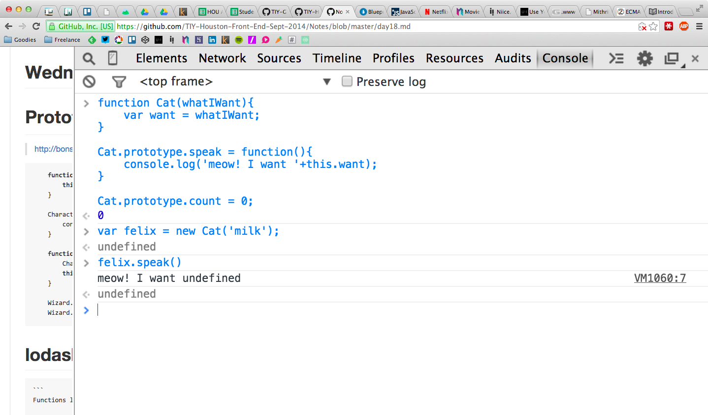
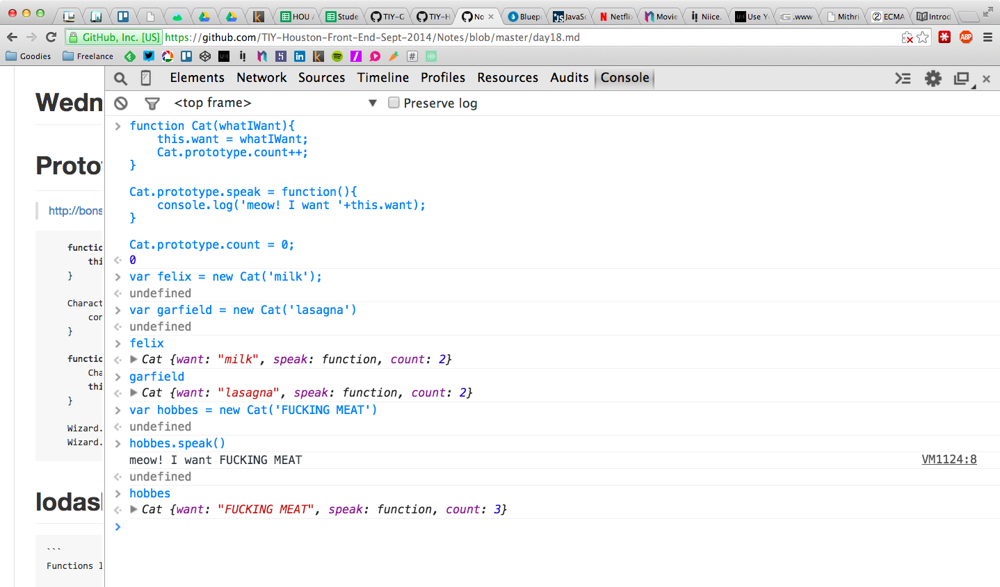

# Wednesday, Oct 15th

```js
 _________________________________________
/ Today we covered review of yesterday,   \
| which includes $.when, $.get, Promises  |
| (.then), _.template, and the setup      |
| shell script I provided. Additionally,  |
| we covered Prototypes and Constructors  |
| today, as well as the keyword. Finally, |
| I live-coded an ugly version of the     |
\ Github repo page.                       /
 -----------------------------------------
 \     /\  ___  /\
  \   // \/   \/ \\
     ((    O O    ))
      \\ /     \ //
       \/  | |  \/
        |  | |  |
        |  | |  |
        |   o   |
        | |   | |
        |m|   |m|
```

# Prototypes, Constructors, `this`

> http://bonsaiden.github.io/JavaScript-Garden/#object.prototype





# In-class repo - RepoMan

You can find the repo of RepoMan at https://github.com/TIY-Houston-Front-End-Sept-2014/RepoMan and the gh-pages version at http://tiy-houston-front-end-sept-2014.github.io/RepoMan/

# Notes on process - how to think about RepoMan

1. Get your project repo setup online, then use the setup script to handle everything.

```sh
curl <raw_script_URL> > ./install.sh
chmod a+x ./install.sh
./install.sh <folderName> <repoUrl>
```

2. Run `gulp watch` and open your browser to `localhost:3000`. Make sure index.html and everything is setup to load your CSS/JS. Test it.
3. Start with barebones HTML/CSS and put some wireframe code on the page. Test it.
4. Start the JavaScript file with a Constructor and Prototype functions, outlining what you need. Get a `console.log()` into your `init()` function and test that it is visible in Chrome Dev Tools.
5. Write some methods to load the data over the network; `console.log()` the result and test it (again, in Chrome Dev Tools).
6. Write some template HTML and get it to look half-decent in index.html. Test it.
7. Move that little segment of HTML into its own HTML file, try to load it in JS, and `console.log()` it. Test it.
8. Make a function to `_.template()` that template file and the data and put it onto the DOM. Test it.
9. Repeat steps 5-9 til' all is done.

# Homework

1. Write a blog post reflecting on what we did today.
2. Starting from scratch on your own repo, recreate what we did today in class to the best of your ability.

