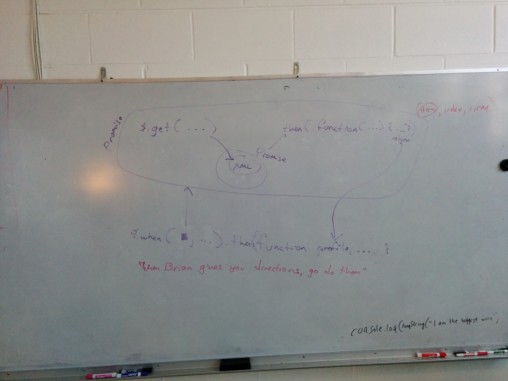

# Wednesday, Oct 15th

```js
 _________________________________________
/ Today we covered review of yesterday :-) \
 -----------------------------------------
 \     /\  ___  /\
  \   // \/   \/ \\
     ((    O O    ))
      \\ /     \ //
       \/  | |  \/
        |  | |  |
        |  | |  |
        |   o   |
        | |   | |
        |m|   |m|
```

# The Whiteboard




# Homework

1. Write a blog post reflecting on what we did today.
2. Redo RepoMan again with a brand new Github repo, but this time, from your own work. Repetition is strong with the force.

# Notes on process - how to think about RepoMan

1. Get your project repo setup online, then use the setup script to handle everything.

```sh
curl <raw_script_URL> > ./install.sh
chmod a+x ./install.sh
./install.sh <folderName> <repoUrl>
```

2. Run `gulp watch` and open your browser to `localhost:3000`. Make sure index.html and everything is setup to load your CSS/JS. Test it.
3. Start with barebones HTML/CSS and put some wireframe code on the page. Test it.
4. Start the JavaScript file with a Constructor and Prototype functions, outlining what you need. Get a `console.log()` into your `init()` function and test that it is visible in Chrome Dev Tools.
5. Write some methods to load the data over the network; `console.log()` the result and test it (again, in Chrome Dev Tools).
6. Write some template HTML and get it to look half-decent in index.html. Test it.
7. Move that little segment of HTML into its own HTML file, try to load it in JS, and `console.log()` it. Test it.
8. Make a function to `_.template()` that template file and the data and put it onto the DOM. Test it.
9. Repeat steps 5-9 til' all is done.

# LevelUp

Got it done?

Try again with this barebones `app.js`:

```js
_.templateSettings.interpolate = /{([\s\S]+?)}/g;

function RepoMan(githubUsername) {
    this.username = githubUsername;

    this.init();
}

RepoMan.prototype.getUserInfo = function() {
	// ..
};

RepoMan.prototype.getRepoInfo = function() {
    // ..
};

RepoMan.prototype.loadTemplateFile = function(templateName) {
    // ..
};

RepoMan.prototype.putProfileDataOnPage = function(profileHtml, profile) {
    // ..
};

RepoMan.prototype.putRepoDataOnPage = function(repoHtml, repos) {
    // repos.sort(..).map(..).join('')...
};


RepoMan.prototype.init = function() {
    var self = this;
    // start doing shit...
    $.when(
        /// ...
    ).then(function(profile, repos, profileHtml, repoHtml) {
        // ...
    })
};

window.onload = app;

function app() {
    var myRepo = new RepoMan('matthiasak');
}
```