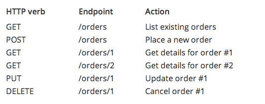

# Curriculum from today

# In simplest terms: What is a database?

It's a spreadsheet.

# What are RESTful API's?

First, a long description: http://stackoverflow.com/questions/671118/what-exactly-is-restful-programming/671132#671132

Now, let's **distill** ths a bit.

For the Github API, there are various **resources**: `users`, `repos`, `teams`, `notifications`, `feeds`, `emojis`, and so forth. These resources are noted mainly here: https://api.github.com/

A resource, like a `person`, is identifiable by a unique attribute. For a `person`, the unique identifier is a `username`, because no one else should also have that `username`. For a `repo`, it is a large number called an `id`.

That unique identifier, like a `username`, is how we interact with a particular instance of `resource`.

When we interact with databases through a RESTful API, we are given a couple options to interact with resources:

1. `GET` the information record of a particular resource
2. `GET` a collection of records for a group of resources
3. `POST` a new JSON object to the server to create a new record of a resource (i.e. a new `person`)
4. `PUT` an updated version of a record on the server, such as update a `person`'s name
5. `DELETE` a record from a resource collection (such as remove a `person` from the database)

These actions (`GET`, `PUT`, `POST`, `DELETE`) are called HTTP verbs, and are accompanied by equivalent jQuery methods `$.get()`, `$.post()`, and `$.ajax()`.

Simply put, RESTful API's exist because it means there is a standardized way for front-end and back-end (browser and server-side code) to talk to each other.

> example RESTful API interaction



# Etsy's REST API and how to use it:

1. Create an app with Etsy here: https://www.etsy.com/developers/documentation/getting_started/register. This will give you an API key to use. Some services use API keys to provide authorization and to rate-limit people who make too many requests (i.e. spam thousands of requests per second).
2. Get your API key from here: https://www.etsy.com/developers/your-apps
3. API's are released with documentation (how to GET/PUT/POST/DELETE them). One resource on Etsy is called a `listing`, and we can alearn how to `GET listings` from https://www.etsy.com/developers/documentation/reference/listing
4. Test the REST API resources with your own API key:
	- get all active listings: https://openapi.etsy.com/v2/listings/active?api_key=aavnvygu0h5r52qes74x9zvo
	- look at this product on Etsy's website: https://www.etsy.com/listing/114711047/small-snow-white-cube-made-from-english
	- look at the same product on the API: https://openapi.etsy.com/v2/listings/114711047?api_key=aavnvygu0h5r52qes74x9zvo
	- this user made the product: https://www.etsy.com/shop/madebymanos?ref=l2-shopheader-name
	- that same user on the Etsy API: https://openapi.etsy.com/v2/users/19181170?api_key=aavnvygu0h5r52qes74x9zvo
5. Write some code
	```
	var etsy_url = "https://openapi.etsy.com/";
	var version = "v2/";
	var model = "listings/";
	var filter = "active";
	var js = ".js";
	var api_key = "aavnvygu0h5r52qes74x9zvo";
	var complete_api_url = etsy_url + version;

	$.getJSON(complete_api_url + model + filter + js + "?" + "api_key=" + api_key + "&callback=?").then(function(data){
		console.log(data);
	});
	```

# Homework
```

To be done, polished, and provided on Monday.
- Spend longer than 20 minutes and wrote nothing? Ask someone for help or move on!
- Up past 12:30am? GO TO BED!
- Keep "Do Not Disturb" on while you code. Every distraction costs you ~20min of time. Work in 'sprints'. This is scientifically proven.

 _______
| steps |
 -------
  \
   \
       ___
     {~._.~}
      (   )
     ()~*~()
     (_)-(_)

1) install everything with our lovely setup script
2) in the JS
- write an EtsyClient() constructor and functions on that prototype to pull info from Etsy (using our example code above)
- create three templates:
	- listings.html - should print HTML for a group of listings
	- listing.html - should print HTML for a single listing
	- user.html - should print HTML about a user
- the EtsyClient(), should load all the listings and display the listings template
- when a listing is clicked, the page should show that single listing's information AND get the user associated with the listing and show that information with the user template

Some setup code:
----------------------

function EtsyClient(options) {
    if (!options.api_key) {
        throw new Error("Yo dawg, I heard you like APIs. Y U NO APIKEY!?!?");
    }
    this.etsy_url = "https://openapi.etsy.com/";
    this.version = options.api_version || "v2/";
    this.api_key = options.api_key;
    this.complete_api_url = this.etsy_url + this.version;
}

EtsyClient.prototype.pullAllActiveListings = function() {
    var model = 'listings';
    var filter = 'active';
    return $.getJSON(this.complete_api_url + model + filter + ".js?api_key=" + this.api_key + "&callback=?").then(function(data) {
        console.log(data);
    });
}

EtsyClient.prototype.getListingInfo = function(id) {
    var model = 'listings';
    return $.getJSON(this.complete_api_url + model + '/' + id + ".js?api_key=" + this.api_key + "&callback=?").then(function(data) {
        console.log(data);
    });
}
```