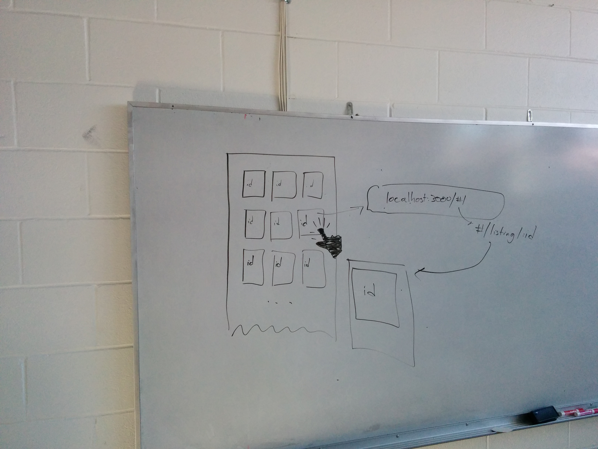
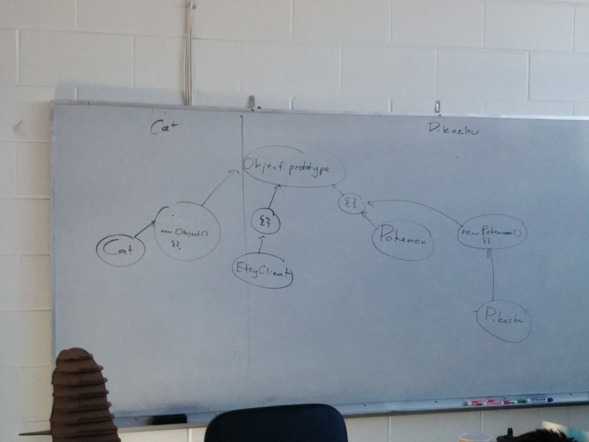
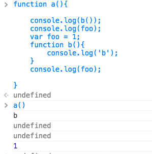
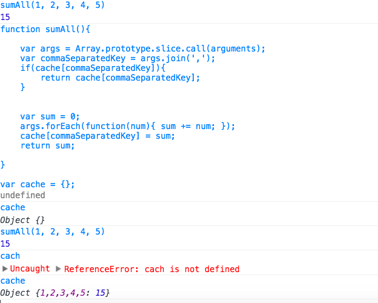

# Tuesday, Oct 21st

```sh
 ________________________________________
/ Today we talked about inheritance in   \
| JS, caching network requests, and some |
\ other browser APIs.                    /
 ----------------------------------------
  \            .    .     .
   \      .  . .     `  ,
    \    .; .  : .' :  :  : .
     \   i..`: i` i.i.,i  i .
      \   `,--.|i |i|ii|ii|i:
           UooU\.'@@@@@@`.||'
           \__/(@@@@@@@@@@)'
                (@@@@@@@@)
                `YY~~~~YY'
                 ||    ||
```

# Whiteboards





# Hoisting

Read about Hoisting here: http://bonsaiden.github.io/JavaScript-Garden/#function.scopes

The following is an example screenshot from class today of hoisting.



# Caching network requests with `$.get()`

Caching is a term used in networking and computing when a a result can be reused.

For instance, if I compute the sum of ten numbers from by passing those ten numbers to `sumAll()`, I could save that result somewhere and return the same result if the same arguments are ever given again later:



Well, we can **cache** any data requested with `$.get()` as well:
```js
EtsyClient.prototype.loadTemplate = function(name){
    if(!this.templates){
        this.templates = {};
    }

    var self = this;

    if(this.templates[name]){
        var promise = $.Deferred();
        promise.resolve(this.templates[name]);
        return promise;
    } else {
        return $.get('./templates/'+name+'.html').then(function(data){
            self.templates[name] = data; // <-- cache it for any subsequent requests to this template
            return data;
        });
    }
}
```

Using `EtsyClient.prototype.loadTemplate()` in this fashion will make a brand new request the first time, and then send back a cached result every call thereafter.

# Inheritance in JavaScript

We have covered Prototypes and Constructors:

```js
function Cat(name){
    this.name = name;
}
Cat.prototype.speak = function(){
    console.log('meow! My name is '+this.name);
}
```

One thing we noted was that any new function that we declare (like `Cat()`) automatically has a prototype chain with the `Object()` function as the highest entity on that prototype chain. In other words, any method on `Object()`'s prototype is available for `Cat()` to use.

### Inheritance and Pokémon

Yes. I'm going to make a mother-effing Pokémon reference. Deal with it. :-)


Imagine our understanding (I hope) of Pokémon:
- All Pokémon can `evolve()`.
- All Pokémon start as the lowest "level" on the food chain, and evolve as they conquer.

Let's model this in JavaScript :-)
```js
function Pokemon(level, levels){
    this.level = level || 0;
    this.levels = levels;
}
Pokemon.prototype.evolve = function(){
    var old_level = this.level;
    this.level = Math.min(this.level+1, this.levels.length-1);
    if(old_level !== this.level){
        console.log(this.levels[old_level]+" evolves into "+this.levels[this.level]+"!");
    } else {
        console.log(this.levels[old_level]+" is at the top of the food chain!");
    }
}

function Pikachu(){
    Pokemon.call(this, 0, ["Pikachu", "Raichu"]);
}
Pikachu.prototype = new Pokemon();
Pikachu.prototype.constructor = Pikachu;

// later, when using it

var myPikachu = new Pikachu();
myPikachu.level; // 0
myPikachu.evolve(); // "Pikachu evolves into Raichu!"
myPikachu.evolve(); // "Raichu is at the top of the food chain!"
```

# Browser APIs

This last section is all about Browser APIs available to us. We've encountered a few already, such as the `requestAnimationFrame()` function that syncs our drawing and DOM manipulation code to the computer's 60Hz refresh rate.

This are great to explore and build on-top of, because they are what create truly immersive applications.

- Device Orientation (http://simpl.info/deviceorientation/)
- `getUserMedia()` (http://simpl.info/getusermedia/)
- Geolocation (https://github.com/samdutton/simpl/blob/master/geolocation/js/main.js)
- Fullscreen API (http://simpl.info/fullscreen/)
- HTML5 Input types (http://simpl.info/inputtypes/)
- localStorage (http://simpl.info/localstorage/)
- Mutation Observer (http://simpl.info/mutationobserver/)
- Object.observe() (http://simpl.info/observe/)
- Notification API (http://aurelio.audero.it/demo/web-notifications-api-demo.html) and (http://caniuse.com/notifications)
- Page Visibility API (http://simpl.info/pagevisibility/)
- Web Workers (http://simpl.info/webworkers/)
- Web Speech API (https://simpl.info/stt/) and Web Speech SYnthesis API (http://simpl.info/tts/)
- GamePad API (http://caniuse.com/#feat=gamepad) and (http://www.html5rocks.com/en/tutorials/doodles/gamepad/)
- online/offline status (http://caniuse.com/online-status)
- requestAnimationFrame (http://caniuse.com/requestanimationframe)
- screen orientation API - lock the screen in a particular direction (http://aurelio.audero.it/demo/screen-orientation-api-demo.html) and (http://caniuse.com/screen-orientation)
