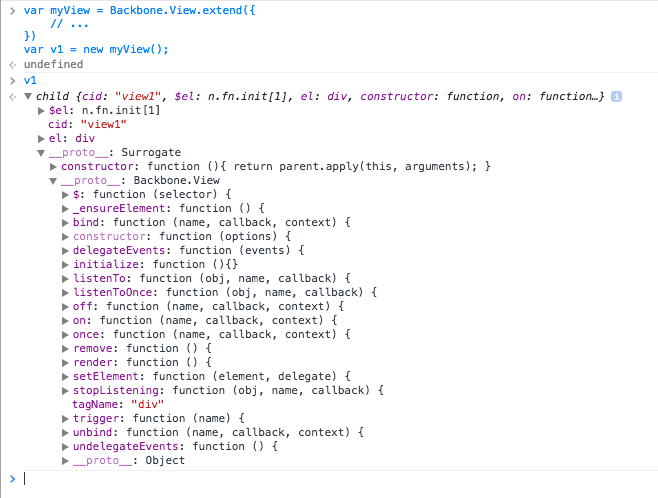

# Monday, November 2nd

```sh
```

# Backbone an MVC (Model-View-Controller) JavaScript Framework

We've just finished our stint in API's. We've learned that API's have a lot to offer, and that they make a service or ecosystem of apps more scalable and open, where we can integrate almost any services we choose into a nice "mashup".

We've already hit the nail on the head when it comes to MVC structure. The rest of the class is all about MVC frameworks, patterns, and problem-solving with code.

So let's have a gander again at MVC one last time. An MVC application is broken into three parts:

- `M` - Model: the data/JSON stored from an API, and the methods that pull the data from an API
- `V` - View: the templates created, and maybe the methods that draw them to the screen
- `C` - Controller: the mechanisms used to control application flow and state, such as with Path.js to handle hash-routes

Most of the time, the Model is the part of our code that pulls and pushes information back-and-forth to an API.

# Today, Backbone Views

Imagine we wanted to write our own class to manage:

- the current container element on the DOM
- clicks, inputs, and other DOM events on this container (or inside it)
- any logic and state-management code for showing or hiding something
- any template loading and HTML generating code

This all falls under the Backbone View.

> **Note:** our setup-script.sh has been updated to include Backbone!

# A few things about Backbone

Backbone apps have three prerequisite libraries in order for them to work:

- jQuery
- Underscore/lodash
- Backbone.js :-)

Backbone's own constructors are a mashup of good ol' vanilla JS, and mixins for automatically using jQuery and lodash to provide some nicely integrated functionality.

The View, as mentioned before, provides a hidden Constructor enforces particular conventions on how we write code with Backbone. That is how frameworks "do", they simply give you an API, and you use it. Some will be more "opinionated" than others, but Backbone tends to err on the more flexible side of MVC frameworks.

Let's have a look at a Backbone View.

# Creating our first Backbone View

In Backbone-world, we always **create our own constructors by extending the default**.

```js
var myView = Backbone.View.extend({
    // ...
})
var v1 = new myView();
console.log(v1);
```

**Notice that we first just use `Backbone.View.extend()` (no `new`), which creates our myView Constructor.** Then we use `new myView()`.

`v1` looks like this:



Notice a few properties on this 'feller:
- `$el` and `el` - `el` is the html element that is the outermost container of our view. This would be akin to the place your `document.querySelector()` code would find a container element in `index.html` to insert templates. The `$el` property is just the jQuery wrapper around this element, to provide us with some jQuery methods, if we need them.
- `cid` - there is a unique id given to every element created by a Backbone constructor (View, Model, etc). This is that unique id. For now, we'll just accept this exists and move on.

Notice some methods on our `prototype`, provided by Backbone.View, which are accessible on the instance `v1`:
- `v1.$` - jQuery function used to select child elements in our view. For example, we can get all links in our view with `v1.$('a')`.
- `v1.initialize` - whenever the constructor was called (`new myView()`), our `initialize` function is called. This is similar to our `init()` function created on the vanilla JavaScript stuff when we were learning about APIs.
- `v1.remove` - this is a function that will remove this View, container and all, from the DOM.
- `v1.render` - this is a function that we will need to write ourselves (by default, it does nothing). This function should add our container to the DOM (with either a write to an `innerHTML`, `$.append()`, etc)
- `v1.tagName` - by default, when we create a View, Backbone will create a `<div>` element as the container, which will need to be added to the page in `v1.initialize()` or `v1.render()`. We can change this in the options given to `Backbone.View.extend()`.

# Options for Backbone Views

We can pass options in `Backbone.View.extend({})`. Notice that the argument to `extend` is an object. The `extend` method actually comes from `_` (lodash), and Backbone just has something in its code where `this.extend = _.extend;`. The `extend` function simply works like this:

```js
_.extend(
    { name: 'fred' },
    { employer: 'slate' },
    {years: 15}
    // ...
);
// → { name: 'fred', employer: 'slate', years: 15 }
```

It takes all properties from the objects, and bundles them up into a single object, giving precedence to right-most arguments.

That last bit can be explained in code:

```js
_.extend(
    { name: 'fred', employer: 'slate' },
    { name: 'matt' }
    // ...
);
// → { name: 'matt', employer: 'slate' }
```

See how `name: 'fred'` was cancelled out in favor of `name: 'matt'`?

Now, let's continue with Backbone.View options:

```js
var AnimalView = Backbone.View.extend({
    tagName: 'li', // defaults to div if not specified
    className: 'animal', // optional, can also set multiple like 'animal dog'
    id: 'dogs', // also optional
    events: {
        'click':         'alertTest',
        'click .edit':   'editAnimal',
        'click .delete': 'deleteAnimal'
    },
    initialize: function(options) {
        // 1. Sometimes it will be instantiated without options, so to guard against errors:
        var options = _.extend(
            {},
            {
                $container: $('body')
            },
            opts
        );

        // 2. Part of putting a view into its initial state is to put its element
        //    into the DOM. Its container should be configurable using an option
        //    so that a) it can be used anywhere in the app and b) it can be
        //    easily unit tested.
        options.$container.append(this.el);

        // 3. Render the content of the view
        this.render();
    },
    render: function() {
        this.$el.html('test');
    },
    alertTest: function(){
        alert('hi!');
    },
    editAnimal: function(){
        // ...
    },
    deleteAnimal: function(){
        // ...
    }
});
```