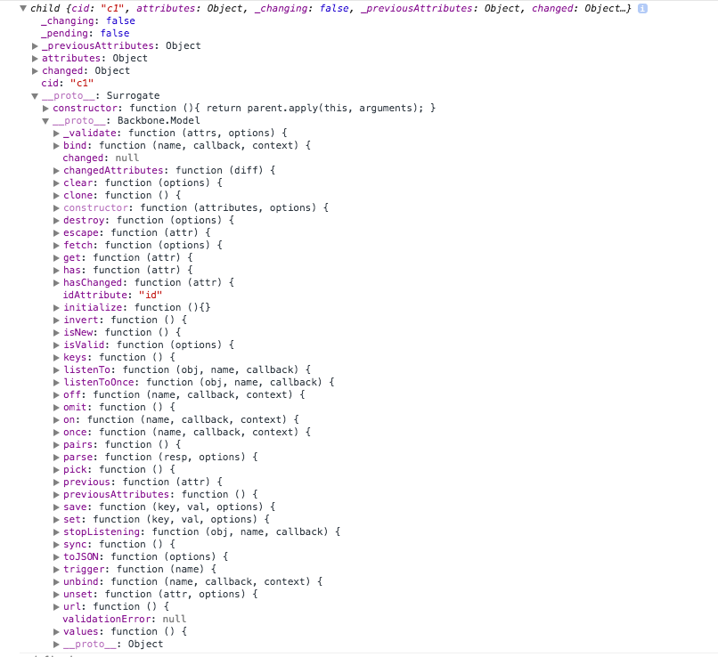
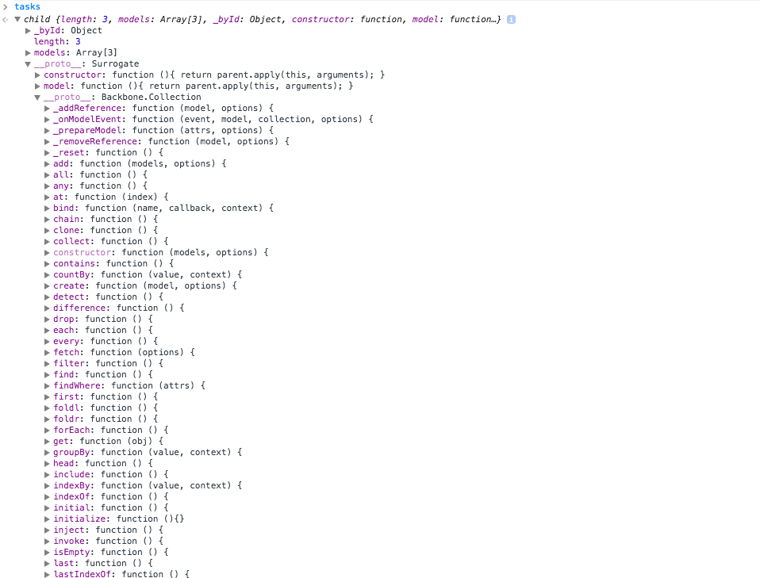

# Wed, Nov 5th and Thur, Nov 6th

```sh
```

# Backbone Models

Imagine we wanted to write our own class to manage:

- pulling and syncing data from a server
- enforcing defaults on domain data
- providing validation on some JSON data being pulled down from the server
- an event system for updates to domain data

This all falls under the Backbone Model.

> **Note:** our setup-script.sh has been updated to include Backbone!

# Creating our first Backbone Model

In Backbone-world, we always **create our own constructors by extending the default**.

```js
var Task = Backbone.Model.extend({
    // ...
})
var t1 = new Task({});
console.log(t1);
```

`t1` looks like this:



Notice a few properties on this 'feller:
- `attributes` - a collection of key/value pairs that are passed to the instance constructor (`new Task({ ... })`) or provided in the `defaults`.
- `changed` - an object that will hold any key/value pairs of the Model instance that were just changed
- `cid` - there is a unique id given to every element created by a Backbone constructor (View, Model, etc). This is that unique id for this Model instance. For now, we'll just accept this exists and move on.

Notice some methods on our `prototype`, provided by Backbone.Model, which are accessible on the instance `t1`:
- `changedAttributes()` - returns a copy of the `changed` object, used to get the diff between the current and previous state for the instance
- `clear()` - empties out a Model's data
- `clone()` - creates an exact replica in memory of the Model instance and its data
- `fetch()` - pulls JSON information from a defined URL
- `initialize()` - whenever the constructor was called (`new Task()`), our `initialize` function is called. This is similar to our `init()` function created on the vanilla JavaScript stuff when we were learning about APIs.
- `off()/on()` - used to handle add/update/delete events, and so forth
- `sync()` - attempts to push this instance data up to a server
- `toJSON()` - creates a POJO (plain old JS object literal) with all the data from the instance.
- `set()/get()` - these are the getter and setter methods to use when retrieving or updating an instance's data; **you must use these when manipulating the model's data.**

# Defining Model (constructor) properties

There are two cases we supply options to our Backbone instances:
1. as part of the configuration to `Backbone.Model.extend({})`
2. as part of the options object to `new Task({})`

**We define the code for our `Task()` constructor and prototype in #1, and we define the specific data for our instance in #2.**

# Options for `Backbone.Model.extend()`

We can pass options in `Backbone.Model.extend({})`:

```js
var Task = Backbone.Model.extend({
    defaults: {
        title: 'Task title',
        isDone: false,
        inProgress: true
    }
});

var t1 = new Task({});
t1; // { title: 'Task title', isDone: false, inProgress: true }
```

# Create Models with attributes

We can pass instance data to the constructor:

```js
var t1 = new Task({
    title: 'Some task name',
    dueDate: new Date(),
    isDone: false,
    inProgress: true
});

t1; // { title: 'Some task name', dueDate: DateObject, isDone: false, inProgress: true }
```

# Validating properties on Model instances

Whenever we set properties on a Model instance, the `Model#validate()` method will be automatically called. If `validate()` returns a string, an `Error()` is thrown with that message.

```js
var Task = Backbone.Model.extend({
    defaults: {
        title: 'Task title',
        isDone: false,
        inProgress: true
    },
    validate: function(attrs, options){
        if (!attrs.title){
            return 'Your task must have a name!';
        }
    }
});

var t1 = new Task({ title: false }); // will throw an error "Your task must have a name!"
```

# Getting attributes

Using the `Model#get()` method we can access Model properties at anytime.

```js
var t1 = new Task({});

t1.get('title'); // 'Task title'
t1.get('isDone'); // false
```

# Setting Model attributes

We can manipulate Model instances with `Model#set()` or with our own methods defined in the Constructor:

```js
var Task = Backbone.Model.extend({
    defaults: {
        title: 'Task title',
        isDone: false,
        inProgress: true
    },
    validate: function(attrs, options){
        if (!attrs.title){
            return 'Your task must have a name!';
        }
    },
    setDone: function(){
        this.set('isDone', true);
    }
});

var t1 = new Task({});
t1.setDone();
t1.set({ inProgress: false, title: '(done)' }); // we can also set multiple items in one call
```

# Listening for change events on the Model

Models by default trigger 'change' events whenever data is updated.

```js
var Task = Backbone.Model.extend({
    initialize: function(){
        this.on('change', function(model){
            alert('something was changed');
        });
        this.on('change:title', function(model){
            alert('title was changed');
        });
    },
    defaults: {
        title: 'Task title',
        isDone: false,
        inProgress: true
    },
    validate: function(attrs, options){
        if (!attrs.title){
            return 'Your task must have a name!';
        }
    },
    setDone: function(){
        this.set('isDone', true);
    }
});

var t1 = new Task({});

t1.setDone();
// ALERTED: "something was changed"

t1.set({ title: "(done)" });
// ALERTED: "something was changed"
// ALERTED: "title was changed"
```

# Models can validate, have defaults, and trigger events when something changes... they can also do your AJAX requests for you.

Models are used to represent data from your server and actions you perform on them will be translated to RESTful operations:
- GET translates to a `$.get` (`type: "GET"`)
- CREATE translates to a `$.post` (`type: "POST"`)
- UPDATE translates to a `$.ajax` with `type: "PUT"`
- DEL translates to a `$.ajax` with `type: "DEL"`

### Think back to our Etsy API requests.

- When we pulled all active listings, we got an array of data.
- When we setup routing with the Etsy project, we queried the Etsy API with a different URL that targeted a **specific id**.

**When we create Models and have them pull data from the server, we will give them an `id`, then tell them to `fetch()`.**

# Getting Model data from a server with `Model#fetch()`

We've mentioned something before:

> Nearly every record you pull from ANY API has a unique identifier -- an `id`. This is what we use to too a Model to pull that specific piece of information form the server.

Well, with Backbone Models, we need just two things:
- The `id` of an individual Etsy record
- The URL to put that `id` into when making the request for that individual Etsy item

Let's take a look at some example code for a fake API on the localhost. **Notice the use of Promises!!**

```js
var UserModel = Backbone.Model.extend({
    urlRoot: '/user',
    defaults: {
        name: '',
        email: ''
    }
});

var matt = new UserModel({ id: 1 });
matt.fetch().then(function(){
    // AJAX request finished!
})
```

# Saving Models to a server with `Model#save()`

```js
var UserModel = Backbone.Model.extend({
    urlRoot: '/user',
    defaults: {
        name: '',
        email: ''
    }
});

var matt = new UserModel({ name: "Matt", email: "matt@theironyard.com" });
matt.save().then(function(model){
    // AJAX request finished!
    alert(model.toJSON());
})
```

# Deleting Models from a server with `Model#destroy()`

```js
var UserModel = Backbone.Model.extend({
    urlRoot: '/user',
    defaults: {
        name: '',
        email: ''
    }
});

var matt = new UserModel({ id: 1 });
matt.destroy().then(function(model){
    // AJAX request finished!
})
```

# Backbone Collections

Collections are just lists of a particular Model constructor with events that fire when something is added, changed, removed, etc. A Collection constructor is created (surprise!) yet again with `Backbone.Collection.extend({})`:

```js
var TaskList = Backbone.Collection.extend({
    model: Task
});
```

Notice that we only add one property to the options, a Model constructor, **NOT a Model instance**. There is an **optional** `url` argument that Backbone will use (when `fetch()` is called) to fill a Collection with Models populated with data from that `url`.

Let's create a Collection instance, and pass it an array of JSON data:

```js
var tasks = new TaskList([
    {title: "some task", isDone: true},
    {title: "some task 2", inProgress: false},
    {title: "some task 3"}
]);
```

The `tasks` Collection instance looks like this in the Chrome Dev Console:



Notice a few properties on this 'feller:
- `length` - the number of Models in this Collection.
- `models` - an array of Models created/added by the constructor or through `Collection#add()`

Notice some methods on our `prototype`, provided by Backbone.Collection, which are accessible on the instance `tasks`. There are a **lot**, because Collections deal with arrays of Models, and Backbone uses lodash behind the scenes. Thus, it makes sense why we would see a lot of methods here:
- `add()` - adds a Model to the Collection and triggers an event
- `fetch()` - pulls down an updated Collection from a specified URL, returns a Promise object
- `get()/set()`
- `forEach()`
- `on()/off()`
- and of course all the lodash methods

# Creating a list of Models automatically with `Collection#fetch()`

When querying the Etsy API, we had two things going on:
1. Request all active listings, which returned some object with an array of listings
2. We then would make a request to a separate URL with an `id` in it to make requests for an individual listing

** Number 1 above would be handled by a Collection, while Number 2 would be handled by a Model. **

```js
var EtsyListing = Backbone.Model.extend({});

var EtsyItems = Backbone.Collection.extend({
    model: EtsyListing,
    api_key: "aavnvygu0h5r52qes74x9zvo",
    url: function(){
        return [
            'http://openapi.etsy.com/v2/listings/active.js?',
            "api_key=",
            this.api_key,
            "&callback=?"
        ].join('')
    }
});

var items = new EtsyItems();
items.fetch().then(function(collection){
    // AJAX function has finished!
})
```

When we call `items.fetch()`, Backbone's Collection code will fire of a request and try to automatically create a bunch of `EtsyListing`'s.

There's one last thing we need to do. Backbone Collections assume that the data they are pulling down with `fetch()` is **just an array**. Instead, Etsy gives us an array nested inside an object:

```js
{
    count: 50100,
    results: {[ ... ]}
}
```

What we need to do is tell the `EtsyItems` Collection to look for the `results` property and start creating `EtsyListing` items from there:

```js
var EtsyListing = Backbone.Model.extend({});

var EtsyItems = Backbone.Collection.extend({
    model: EtsyListing,
    api_key: "aavnvygu0h5r52qes74x9zvo",
    url: function(){
        return [
            'http://openapi.etsy.com/v2/listings/active.js?',
            "api_key=",
            this.api_key,
            "&callback=?"
        ].join('')
    },
    parse: function(data){
        return data.results;
    }
});

var items = new EtsyItems();
items.fetch().then(function(collection){
    // AJAX function has finished!
})
```

The `parse` property given to `EtsyItems` tells Backbone Collection to look into the data returned and use the `results` array to create the Models.

# Homework for the weekend

- Create a **BRAND NEW** copy of your latest Backbone View repo. In otherwords, clone it or create a new repo and copy everything over.
- Update your code to a Collection. This Collection will create Models, and each `Model#initialize()` will create its own View:

    ```js
    var EtsyView = Backbone.View.extend({
        initialize: function(options){
            // this.model will be the EtsyListing instance that created me
        }
    })

    var EtsyListing = Backbone.Model.extend({
        initialize: function(options){
            this.view = new EtsyView({ model: this });
        }
    });

    var EtsyItems = Backbone.Collection.extend({
        model: EtsyListing,
        api_key: "aavnvygu0h5r52qes74x9zvo",
        url: function(){
            return [
                'http://openapi.etsy.com/v2/listings/active.js?',
                "api_key=",
                this.api_key,
                "&callback=?"
            ].join('')
        },
        parse: function(data){
            return data.results;
        }
    });
    ```

