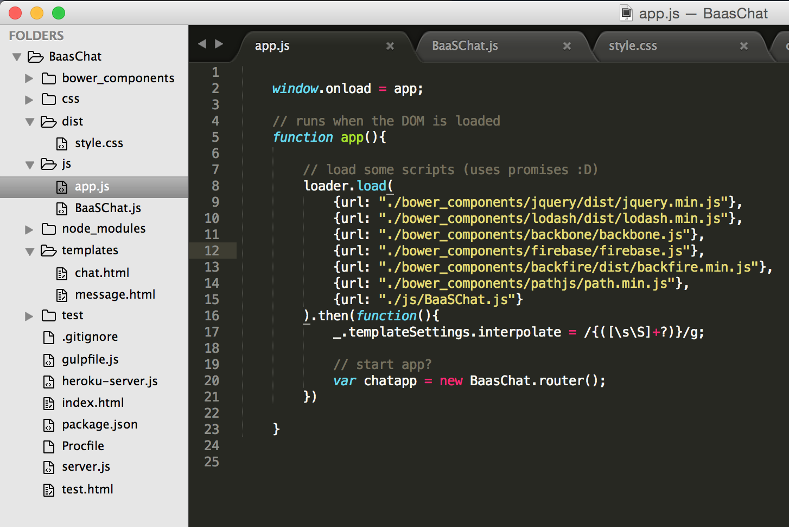
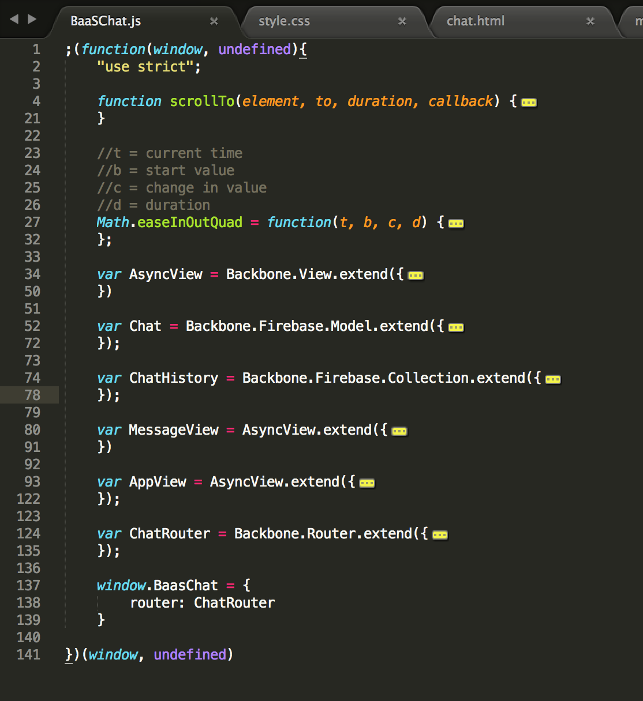

# Tuesday, Nov 11th

```sh
Tuesday, Nov 11th
 _______________________________________
/ Today we reviewed Backbone            \
| Models/Collections, walked through    |
| example code, and discussed questions |
| various people were having with the   |
\ code and or the world                 /
 ---------------------------------------
  \
   \
       __
      UooU\.'@@@@@@`.
      \__/(@@@@@@@@@@)
           (@@@@@@@@)
           `YY~~~~YY'
            ||    ||


Wednesday, Nov 12th
 _________________________________________
/ Today we glanced at the Firebase app    \
| some more, and will discuss this as the |
| week continues. The rest of the         |
| complexity in apps is still just around |
| organization and learning how to use    |
| Backbone minimally and flexibly (less   |
\ work, more results)                     /
 -----------------------------------------
  \                                  ,+*^^*+___+++_
   \                           ,*^^^^              )
    \                       _+*                     ^**+_
     \                    +^       _ _++*+_+++_,         )
              _+^^*+_    (     ,+*^ ^          \+_        )
             {       )  (    ,(    ,_+--+--,      ^)      ^\
            { (@)    } f   ,(  ,+-^ __*_*_  ^^\_   ^\       )
           {:;-/    (_+*-+^^^^^+*+*<_ _++_)_    )    )      /
          ( /  (    (        ,___    ^*+_+* )   <    <      \
           U _/     )    *--<  ) ^\-----++__)   )    )       )
            (      )  _(^)^^))  )  )\^^^^^))^*+/    /       /
          (      /  (_))_^)) )  )  ))^^^^^))^^^)__/     +^^
         (     ,/    (^))^))  )  ) ))^^^^^^^))^^)       _)
          *+__+*       (_))^)  ) ) ))^^^^^^))^^^^^)____*^
          \             \_)^)_)) ))^^^^^^^^^^))^^^^)
           (_             ^\__^^^^^^^^^^^^))^^^^^^^)
             ^\___            ^\__^^^^^^))^^^^^^^^)\\
                  ^^^^^\uuu/^^\uuu/^^^^\^\^\^\^\^\^\^\
                     ___) >____) >___   ^\_\_\_\_\_\_\)
                    ^^^//\\_^^//\\_^       ^(\_\_\_\)
                      ^^^ ^^ ^^^ ^
```

# BaaS (Backend as a Service)

Backends-as-a-Service replace the need for a dev-team to implement particular pieces of functionality on our servers. In our case, this means that instead of coding a "smart" server in Node.js (or something), we can just host our code on Github and use some resource (via JavaScript).

BaaS's vary a little from typical API's, because htey let you store your own application data in your own defined structure on someone else's server :-)

There are many BaaS's out there, some of which have already been mentioned in our [day24 notes](./day24.md):

- Dropbox - https://www.dropbox.com/developers/datastore
- AWS - http://aws.amazon.com/sdk-for-browser/
- Firebase - https://www.firebase.com/how-it-works.html
- Parse - https://parse.com/docs/js_guide#javascript_guide - https://parse.com/downloads/javascript/parse-1.2.19.js
- Meteor (has a deploy tool just like heroku, comes with front end and back end code) - http://docs.meteor.com/#top

# All about that BaaS, bout that BaaS...

> an intro to Firebase...

Building an application is full of tedious and difficult tasks. Nearly every app needs a database, an API, and authentication. With Firebase — all of this is done for you.

- Save data in the cloud

    Firebase is a realtime NoSQL database. That means, we just push and pull JSON to/from it.

    This is ideal for things like multiplayer games, too, because Firebase establishes a WebSocket connection (persistent, open TCP connection), which provides very fast bi-directional messages.

- RESTful

    At a high level, Firebase is simply a database with a RESTFul API. Each individual Firebase (read: app) has a name and its own URL endpoint. Therefore if your Firebase’s name is `my-firebase`, the URL would be `https://my-firebase.firebaseio.com/`. Using this API endpoint you can easily store and read data right out of your Firebase.

- Builtin Authentication

    Firebase also provides a Simple Login Service with several types of built-in authentication. Simple Login allows you to authenticate with email and password or third party providers such as Facebook, Twitter, Google, and GitHub. If you need to integrate with your own login system, that’s no problem. Simple Login supports custom login methods as well.

# Firebase - Getting Started

1. Install it with:

    ```sh
    $ bower install --save backfire
    ```

2. Include the downloaded `firebase.js` and `backbone-firebase.js` in your app (using loader?)

    ```js
    loader.load(
        {url: "./bower_components/jquery/dist/jquery.min.js"},
        {url: "./bower_components/lodash/dist/lodash.min.js"},
        {url: "./bower_components/backbone/backbone.js"},
        {url: "./bower_components/firebase/firebase.js"},          //<-------
        {url: "./bower_components/backfire/dist/backfire.min.js"}, //<-------
        {url: "./bower_components/pathjs/path.min.js"},
        {url: "./js/BaaSChat.js"}
    ).then(function(){
        _.templateSettings.interpolate = /{([\s\S]+?)}/g;

        // start app?
        var chatapp = new BaasChat.router();
    })
    ```

3. Use `Backbone.Firebase.Collection` for your collection constructor, and give it a `firebase` property with a `Firebase` instance and an app url. The "/chat" at the end denotes where the collection will `fetch()` and `sync()` with. Behind the scenes, Backbone and it's Firebase plugin (Backfire) will do these "GET" / "POST" / "PUT" / "DEL" requests to that URL.

    ```js
    var TodoList = Backbone.Firebase.Collection.extend({
        model: Todo,
        firebase: new Firebase("https://<your-firebase>.firebaseio.com/")
    });
    ```

4. If you're modifying the models directly (`model.save()`, etc), you'll probably also need to link your model constructor to the `chat` firebase endpoint.

    ```js
    var Todo = Backbone.Model.extend({
        firebase: new Firebase("https://<your-firebase>.firebaseio.com/chat")
    })
    ```

# An example app - All About That BaaS

There will be a number of things covered here, but a few important generic Backbone things to notice as well. I will point those out when we get there!  **Look for bold.**

I came up with an idea for demonstrating what Firebase and Backbone can do: a chatroom app :-)

Why?

- Firebase provides live updates to collections via Backbone's `collection.on('change', ...)` and `collection.on('add', ...)` events, making it easy for me to get updates whenever someone pushes new information online.
- Firebase makes it easy to push new data to the server. I can create a new `chat` item on the server by using Backbone's `collection.create({ ... })`. Backbone's `collection.create()` adds a model to the collection with that data (`{...}`), and then automatically calls `model.save()`. Backfire will make `model.save()` actually push the data to Firebase.
- Backbone is perfectly suited for event-driven stuff. If we have collections of data, and we can tell when that data changes (events). Then, when an event triggers, we can tell a view to update the visual representation on the DOM.

## The structure

Here's a screenshot of the project structure:



I have two templates, one "definition" file (BaaSChat.js), and my app.js file that loads all resources to the browser.

## The process

1. My code in BaaSChat.js will create a single global object called `BaaSChat`. This `BaaSChat` object will store references to any object I want to have accessible. This pattern is common practice for libraries, such as Backbone and jQuery, where they have a lot of internal code, but they expose only a few properties.

    In my app.js file, I create an instance of my Backbone router:

    ```js
    var chatapp = new BaasChat.router();
    ```

2. My `BaaSChat.js` file is where all the rest of the JS goes. :-) Check out this structure:

    

    - The `scrollTo` and `Math.easeInOutQuad` functions are used to scroll the page to the bottom when someone posts a message (like Hipchat does, latest messages scroll into view automatically)
    - The `AsyncView` created from `Backbone.View.extend()` has a template loading method given to it, so when I create the `AppView` and `MessageView` from `AsyncView.extend()`, they inherit `AsyncView`'s prototype chain (and methods, like `loadTemplate()`)
    - The `AppView`, when initialized, creates `this.collection = new ChatHistory();`. `ChatHistory` is a `Backbone.Firebase.Collection` that can push and pull from/to Firebase. No extra code needed:

        ```js
        var ChatHistory = Backbone.Firebase.Collection.extend({
            model: Chat,
            firebase: new Firebase("https://matthiasak.firebaseio.com/").limitToLast(10)
        });
        ```

    - Notice the `new Firebase(...).limitToLast(10)` line above. This creates a new Firebase instance which pulls the latest 10 messages immediately.
    - In the `AppView`'s `initialize()`, we have the following piece of code. Check the code comments here:

        ```js
        this.listenTo(this.collection, "add", function(model, collection, options){

            // when the collection:
            // - receives new data from Firebase (a.k.a. someone else added a chat message to the
            //   collection, Firebase pushes live updates to our Collection)
            // - or when we add a new chat message to our collection locally (and push a new
            //   chat message to others, who receive an update over the network)
            //
            // ... then draw a new subview to the <ul> in the DOM.

            this.$ul.append(new MessageView({model: model}).el)
            scrollTo(this.el, this.$ul[0].offsetHeight, 250);

        });
        ```

    - All interaction in the app is then handled by the `AppView`, where the `submit` event triggered by the form is triggered by clicking the button or hitting `enter` on your keyboard:

        ```js
        var AppView = AsyncView.extend({
            ...,
            events: {
                "submit form": "sendMessage"
            },
            sendMessage: function(event){
                event.preventDefault(); // prevent page from refreshing
                this.collection.create({ sender: this.options.username, text: this.input.value });
                this.input.value = "";
            }
        });
        ```

# Ét Voila!

Here is all the updated code here:

- Repo: https://github.com/TIY-Houston-Front-End-Sept-2014/all-about-that-baas-chat
- Live version: http://tiy-houston-front-end-sept-2014.github.io/all-about-that-baas-chat/

Backfire Github Repo:

- https://github.com/firebase/backfire

Firebase's official Documentation site:

- https://www.firebase.com/docs/web/