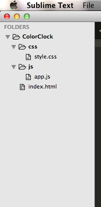

# The Color Clock assignment

First take a look at this screencap:

That is a website!

There is a single `
` container that is horizontally and vertically centered on the page, and the animated background color is just a `transition: all .25s ease` and a `background-color` being changed on the `<body>` tag. The gradient over the background is a dark transparent `::after` element.

There is some JavaScript that prints the time to the container on the screen which uses `setInterval()`, DOM APIs, and `Date()`, among other things.

# Are you up for the challenge?

1. create a new repo on Github called ColorClock,
2. create your html, css, js files with this structure:

	

3. setup gulp on your project (https://github.com/TIY-Houston-Front-End-Sept-2014/Notes/blob/master/day09.md#our-new-gulpfilejs-includes-jshint-to-alert-you-of-errors-whenever-you-save-your-js)
4. setup auto-commits to gh-pages with a git-hook (https://github.com/TIY-Houston-Front-End-Sept-2014/Notes/blob/master/day08.md#want-to-auto-commit-your-work-to-gh-pages)
5. Code!